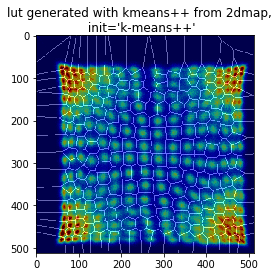
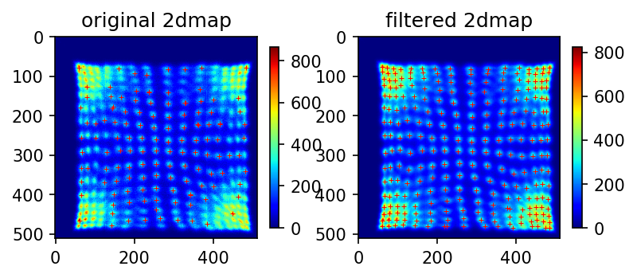

# Machine Learning technique on PET block detector development - Part 1

## Generate crystal lookup table for PQS PET block detector using Machine Learning techniques (v1.0, 2019-05)
---


### 1. Load 2d map previously generated by the data acquistion software
---


```python
# initialize, load libraries

import numpy as np
import pandas as pd
import matplotlib.pyplot as plt
# %matplotlib qt
%matplotlib inline
# %matplotlib notebook

import pickle
from sklearn.externals import joblib
import time

plt.rcParams['figure.dpi'] = 120 # default is 72
```

####  
#### 1.1. Load previously generated lookup table file. The lookup table is a 1024 by 1024 array of 32-bit big-endian unsigned integer. 
---


```python
# twoD_map_datatype 
# big endian using '>'
twoD_map_datatype = np.dtype('>u4')

file = "D:\\ML on PET block\\16x16_38mm_tof_block\\16x16\\15mm\\16x16x15_39mmPMT_Mask19_2011-11-29.lut"
lut = np.fromfile(file, dtype=twoD_map_datatype).reshape((1024,1024))

fig1 = plt.imshow(lut, cmap='prism')
plt.title('Lookup map from loaded 2dmap file')
plt.savefig(".\\figs\\lut_from_lut_file.png", dpi=300)
```


####  
#### 1.2. Load the previously generated 2d map file. The 2d map is a 1024 by 1024 array of 32-bit big-endian unsigned integer, with a head of 16384 bytes for the spectrum (4096 of 4-byte integers).
---


```python
file = "D:\\ML on PET block\\16x16_38mm_tof_block\\16x16\\15mm\\16x16x15_39mmPMT_Mask19_2011-11-29_map.dat"
data2 = np.fromfile(file, dtype=twoD_map_datatype)
spectrum = data2[0:4096]
spectrum
```


    array([109634,  26014,  23725, ...,      0,      0,      0], dtype=uint32)


```python
fig2, ax2 = plt.subplots()
ax2.set_xlim(0, 1000)
ax2.set_ylim(0, max(spectrum[0:1000])*1.1)
ax2.plot(spectrum)
ax2.set_title("Spectrum from the 2dmap file")
plt.savefig(".\\figs\\spec_from_2dmap_file.png", dpi=300)
```


```python
twoDMap = data2[4096:].reshape((1024,1024))
```


```python
plt.imshow(twoDMap[0:512,0:512], vmax = 2000, cmap='jet')
plt.title("The 2dmap from 2dmap file")
plt.savefig(".\\figs\\2dmap_from_2dmap.png", dpi=300)
```


```python
# dry border offset
map_range_row_begin = 50
map_range_row_end = 511
map_range_col_begin = 30
map_range_col_end = 511

```


```python
plt.imshow(lut[map_range_row_begin:map_range_row_end, map_range_col_begin:map_range_col_end], cmap="prism", alpha=0.8)
plt.title("LUT from LUT file, zoomed")
plt.savefig(".\\figs\\lut_from_lut_file_zoomed.png", dpi=300)
```


###  
### 2. Generate the grid that seperates each detector pixel (crystal) from the 2d map LUT data.
---


```python
def generate_grid(lut):
    """
    generate the grid of the lookup table from the lookup table data
    
    input: lookup table, numpy array
    output: grid as numpy array, the same size as the input 
    """
    
    lut_grid = np.zeros(lut.shape)
    pix_x, pix_y = lut_grid.shape

    for i in range(pix_x-1):
        for j in range(pix_y-1):
            if lut[i,j] != lut[i+1,j]:
                lut_grid[i,j] = 1
                lut_grid[i+1,j] = 1
            if lut[i,j] != lut[i,j+1]:
                lut_grid[i,j] = 1
                lut_grid[i,j+1] = 1
    
    return lut_grid
```


```python
lut_grid = generate_grid(lut)

plt.imshow(lut_grid[map_range_row_begin:map_range_row_end, map_range_col_begin:map_range_col_end], cmap="gray")
plt.title("LUT grid generated from lut file")
# plt.imsave("lut_grid.png",lut_grid,cmap="gray")
plt.savefig(".\\figs\\lut_grid_generated_from_lut_file.png", dpi=300)
```


```python
plt.imshow(twoDMap[map_range_row_begin:map_range_row_end, map_range_col_begin:map_range_col_end], vmax = 2000, cmap='gist_ncar')
plt.imshow(lut_grid[map_range_row_begin:map_range_row_end, map_range_col_begin:map_range_col_end], cmap="gray", alpha=0.2)
plt.title("2dmap and LUT grid from original file")
plt.savefig(".\\figs\\2dmap_and_lut_grid_from_original_file.png", dpi=300)
```


###  
### 3. Load raw data and generate the 2d map from the raw data
---


```python
file = "D:\\ML on PET block\\16x16_38mm_tof_block\\16x16\\15mm\\16x16x15_39mmPMT_Mask19_Nov.29.2011_raw.dat"
data = np.fromfile(file, dtype=np.dtype('<u4'))
print(data.shape)
```

    (62582784,)
    

#### 3.1. Load E<sub>0</sub> and create energy spectrum
---


```python
# create energy spectrum from all events

E0 = np.right_shift(np.bitwise_and(data, 0xFFF00000), 20)

fig, ax = plt.subplots()
ax.set_xlim(0, 1000)
plt.hist(E0, bins=512, range=(0,1024), histtype = 'step')
ax.set_title("Energy spectrum from all raw events")
plt.savefig(".\\figs\\Energy_spectrum_from_raw_data.png", dpi=300)
```


####  
#### 3.2. Set energy cut window: low_threshold and high_threshold
---


```python
# set low and high Energy threshold for x and y computation

E_th_low = 400
E_th_high = 800

E_1 = (E0 > E_th_low) & (E0 < E_th_high)
```


```python
Ey = (np.right_shift( np.bitwise_and(data, 0x000FFC00), 10))[E_1]
Ex = (np.bitwise_and(data, 0x000003FF))[E_1]
E1 = E0[E_1]

fig = plt.hist(E1, bins=399, histtype='step')
plt.title('Energy spectrum, zoomed')
plt.savefig('.\\figs\\Energy_spectrum_from_raw_data_zoomed.png', dpi=300)
```


####  
#### 3.3. Create 2d map from raw event data
---


```python
x = (1 - Ex/E1) * 512
y = (1 - Ey/E1) * 512

histgram2d, xedges, yedges = np.histogram2d(x, y, bins=512, range=[[0,512],[0,512]])

```


```python
plt.imshow(histgram2d, vmax=600, cmap='jet')
plt.title('2dmap generated from raw events')
plt.savefig(".//figs//2dmap_from_raw_data.png", dpi=300)
```


##  
## 4. Using Machine Learning techniques to generate the lookup table
---

#### 4.1. K-Means clustering using raw data events
---


```python
from sklearn.cluster import KMeans
```


```python
# number of detector pixels: N, which is the number of clusters here
N = 256
input_data = np.stack((x,y), axis=1)[:256000]
```


```python
# fit or load previous fitted model

FLAG_LOAD = True

if FLAG_LOAD:
    with open('.//models//kmeans1.pkl', 'rb') as fin:
        kmeans1 = pickle.load(fin)
else:
    kmeans1 = KMeans(n_clusters = N, init = 'k-means++', random_state = 1)
    kmeans1.fit(input_data)

    # save trained model to a file
    with open('.//models//kmeans1.pkl', 'wb') as fout:
        pickle.dump(kmeans1, fout)

    joblib.dump(kmeans1, './/models//kmeans1.joblib')

```


```python
grid_x, grid_y = np.meshgrid(np.arange(start=0, stop=512, step=1), \
                             np.arange(start=0, stop=512, step=1))
```


```python
# fit input using 2dmap as the sample_weight
fit_input = np.array([grid_x.ravel(), grid_y.ravel()]).T

with open('.//models//fit_input.pkl', 'wb') as fout:
    pickle.dump(fit_input, fout)
```


```python
lut_kmeans1 = kmeans1.predict(np.array([grid_x.ravel(), grid_y.ravel()]).T).reshape(grid_x.shape)
```


```python
fig, axis = plt.subplots(1,1)

axis.imshow(histgram2d, vmax=600, cmap='jet')
axis.imshow(generate_grid(lut_kmeans1), cmap='gray', alpha=0.4)

fig.suptitle("LUT generated with kmeans++ with 256k events,\n init='k-means++'")

plt.savefig(".//figs//kmeans1_from_raw_events.png", dpi=300)
```


####  
#### 4.2. Using 2dmap as input with sample_weight
---


```python
# fit or load previous fitted model

FLAG_LOAD = True

if FLAG_LOAD:
    with open('.//models//kmeans2.pkl', 'rb') as fin:
        kmeans2 = pickle.load(fin)
else:
    t0 = time.time()

    kmeans2 = KMeans(n_clusters = N, init = 'k-means++', random_state = 1)
    kmeans2.fit(fit_input, sample_weight = histgram2d.ravel())
    print(kmeans2.inertia_)

    t1 = time.time()
    print('running time: {0:0.3f}'.format(t1-t0),'sec')

    # save trained model to a file
    with open('.//models//kmeans2.pkl', 'wb') as fout:
        pickle.dump(kmeans2, fout)

    joblib.dump(kmeans2, './/models//kmeans2.joblib')
    
# running time: 2404.516 sec
```


```python
lut_kmeans2 = kmeans2.predict(fit_input).reshape(grid_x.shape)
```


```python
fig, axis = plt.subplots(1,1)

axis.imshow(histgram2d, vmax=600, cmap='jet')
axis.imshow(generate_grid(lut_kmeans2), cmap='gray', alpha=0.4)

fig.suptitle("lut generated with kmeans++ from 2dmap,\n init='k-means++'")
plt.savefig(".//figs//kmeans2_from_2dmap_no_init.png", dpi=300)

```





####  
#### 4.3. Using grid coordinates as the initial position
---


```python
# initial cluster positions, uniform distributed grid

ini_x, ini_y = np.meshgrid(np.arange(start=15, stop=512-16, step=32), np.arange(start=1, stop=512-16, step=32))
init_input = np.array([ini_x.ravel(), ini_y.ravel()]).T
```


```python
# kmeans3 = KMeans(n_clusters = N, init = init_input, random_state = 1)
# kmeans3.fit(fit_input, sample_weight = histgram2d.ravel())
# print(kmeans3.inertia_)

# fit or load previous fitted model

FLAG_LOAD = True

if FLAG_LOAD:
    with open('.//models//kmeans3.pkl', 'rb') as fin:
        kmeans3 = pickle.load(fin)
else:
    t0 = time.time()

    kmeans3 = KMeans(n_clusters = N, init = init_input, random_state = 1)
    kmeans3.fit(fit_input, sample_weight = histgram2d.ravel())
    print(kmeans3.inertia_)

    t1 = time.time()
    print('running time: {0:0.3f}'.format(t1-t0),'sec')

    # save trained model to a file
    with open('.//models//kmeans3.pkl', 'wb') as fout:
        pickle.dump(kmeans3, fout)

    joblib.dump(kmeans3, './/models//kmeans3.joblib')

#     running time: 269.419 sec
```


```python
lut_kmeans3 = kmeans3.predict(fit_input).reshape(grid_x.shape)
```


```python
fig, axis = plt.subplots(1,1)

axis.imshow(histgram2d, vmax=600, cmap='jet')
axis.imshow(generate_grid(lut_kmeans3), cmap='gray', alpha=0.4)
fig.suptitle("lut generated with kmeans++ from 2dmap,\n init=grid coordinates")
plt.savefig(".//figs//kmeans3_from_2dmap_grid_init.png", dpi=300)
```


* <b>Obviously these three lookup tables obtained by Kmeans++ with different initialization conditions and iterations did not yield a satisfactory result. We need to using better initialization parameters for the Kmeans++ algorithm.</b>
---

##  
## 5.  Using imaing processing method to find the positions of each peak
---


```python
from skimage.feature import peak_local_max
from scipy import ndimage as ndi
```

####  
#### 5.1. Apply 2d gaussian filter to get rid of the noise in the 2d map
---


```python
map_fltd = ndi.gaussian_filter(histgram2d, sigma=0.75, mode='constant')
```


```python
plt.imshow(map_fltd, cmap='jet')
plt.title("Filted 2dmap, gaussian, sigma=0.75")
plt.savefig(".\\figs\\Filted_2dmap.png", dpi=300)
```


* <b>Peak data format: [row, column]!</b>


```python
peaks = peak_local_max(histgram2d, threshold_abs =200, num_peaks = 256, min_distance=20)
peaks0 = np.copy(peaks)
peaks0[:,0] = peaks[:,1]
peaks0[:,1] = peaks[:,0]
print(peaks0.shape)
```

    (128, 2)
    


```python
peaks = peak_local_max(map_fltd, threshold_abs =200, num_peaks = 256, min_distance=5)
peaks1 = np.copy(peaks)
peaks1[:,0] = peaks[:,1]
peaks1[:,1] = peaks[:,0]
print(peaks1.shape)
```

    (256, 2)
    


```python
plt.rcParams['figure.dpi'] = 150

fig, axes = plt.subplots(1,2)

im1 = axes[0].imshow(histgram2d, cmap='jet')
axes[0].plot(peaks0[:,0], peaks0[:,1], 'r+', markersize=3, markeredgewidth=.5)
fig.colorbar(im1, ax=axes[0], shrink = 0.5)
axes[0].set_title("original 2dmap")

im2 = axes[1].imshow(map_fltd, cmap='jet')
axes[1].plot(peaks1[:,0], peaks1[:,1], 'r+', markersize=3, markeredgewidth=.5)
fig.colorbar(im2, ax=axes[1], shrink = 0.5)
axes[1].set_title("filtered 2dmap")

plt.savefig(".//figs//Auto_selected_peaks_from_2dmap.png", dpi=600)
```





* <b>The peak search result from the filtered 2dmap (right) is better than that from the original 2d map (left).</b>

####   
#### 5.2. Switch to interactive mode to modify the selected peaks
---
Since  the peak search algorithm (peak_local_max) could not find all the peaks correctly, we need human interactions to manually add and remove peaks from the 2dmap.


```python
# peaks0: from original 2dmap
# peaks1: from filtered 2dmap

from scipy.spatial import distance

def add_peak_to_list(peak_x, peak_y):
    
    global peaks1
    
    X = [(round(peak_x), round(peak_y))]
    peaks1 = np.append(peaks1, X, axis=0)
    
    print ('Add peak', X, 'to peaks1 list. Number of peak is' ,peaks1.shape[0])
    return True

```


```python
def remove_peak_from_list(peak_x, peak_y, min_dist=5):
    
    global peaks1
    
    X = [(round(peak_x), round(peak_y))]
    d2 = distance.cdist(X, peaks1, metric='euclidean')[0,:]
    
    p_remove_index = d2.argmin()
    d_min = d2.min()
    
    if d_min > min_dist:
        print ('No peak within minimum distance of', min_dist,'.')
        return False
    
    print('min distance=',d2[p_remove_index],' index=',p_remove_index)
    
    print ('Peak at', peaks1[p_remove_index],'near selected point',X, \
           'with distance of', d_min, 'is being removed.')
    
    peaks1 =  np.delete(peaks1,p_remove_index,axis=0)
    print ('Number of peak left', peaks1.shape[0])
    return True

```


```python
%matplotlib qt
plt.rcParams['figure.dpi'] = 150

def update_graph(axes, peaks):
    print('Peak num',peaks1.shape[0]) 
    axes.clear()
    axes.imshow(histgram2d, cmap='jet')
    axes.plot(peaks[:,0], peaks[:,1], 'r+', markersize=5, markeredgewidth=1)
    axes.text(0.0, -0.15, "Add peak: shift+click, Remove peak: ctrl+click", transform=axes.transAxes, fontsize=10)
        
    text = "total peaks:"+str(peaks1.shape[0])
    axes.text(0.0, 1.05, text, transform=axes.transAxes, fontsize=12)
    plt.draw()
        
        
fig_i, axes = plt.subplots()
update_graph(axes, peaks1)
 
pos = []

class key:

    def __init__(self):
        self.shift_is_held = False
        self.ctrl_is_held = False

key_stat = key()
        
def on_key_press(event):
    global key_stat
    
    if 'shift' in event.key:
        key_stat.shift_is_held = True
    if 'control' in event.key:
        key_stat.ctrl_is_held = True
        
        
def on_key_release(event):
    global key_stat

    if 'shift' in event.key:
        key_stat.shift_is_held = False    
    if 'control' in event.key:
        key_stat.ctrl_is_held = False

        
def onclick(event):
    global key_stat
    global axes, peaks1, fig_i

    ret = False
    
    if key_stat.shift_is_held and not key_stat.ctrl_is_held:
        ret = add_peak_to_list(event.xdata, event.ydata)
        print('ret=',ret)
        
    if key_stat.ctrl_is_held and not key_stat.shift_is_held:
        ret = remove_peak_from_list(event.xdata, event.ydata)
    
    if ret:
        update_graph(axes,peaks1)
        ret = False


cid_kye_p = fig_i.canvas.mpl_connect('key_press_event', on_key_press)
cid_key_r = fig_i.canvas.mpl_connect('key_release_event', on_key_release)
cid_mouse_press = fig_i.canvas.mpl_connect('button_press_event', onclick)
   

fig_i.show()

```

    Peak num 256
    No peak within minimum distance of 5 .
    min distance= 2.23606797749979  index= 9
    Peak at [218 480] near selected point [(217.0, 478.0)] with distance of 2.23606797749979 is being removed.
    Number of peak left 255
    Peak num 255
    Add peak [(420.0, 483.0)] to peaks1 list. Number of peak is 256
    ret= True
    Peak num 256
    

####  
####  5.3. Save peak positions and 2dmap with peaks
---


```python
with open('.//models//peak_positions.pkl', 'wb') as fout:
        pickle.dump(peaks1, fout)

joblib.dump(peaks1, './/models//peak_positions.joblib')

```


    ['.//models//peak_positions.joblib']


```python
%matplotlib inline
# %matplotlib notebook
plt.rcParams['figure.dpi'] = 150

```


```python
fig_i, axes = plt.subplots()

im1 = axes.imshow(histgram2d, cmap='jet')
axes.plot(peaks1[:,0], peaks1[:,1], 'r+', markersize=5, markeredgewidth=1)
plt.savefig(".//figs//2dmap_with_peaks.png", dpi=300)
```


####  
####  5.4. Redo Kmeans++ using the coordinates of the peaks as the initial input
---


```python
FLAG_LOAD = True

if FLAG_LOAD:
    with open('.//models//kmeans4.pkl', 'rb') as fin:
        kmeans4 = pickle.load(fin)
else:
    t0 = time.time()

    kmeans4 = KMeans(n_clusters = N, init = peaks1, random_state = 1, n_init=1)
    kmeans4.fit(fit_input, sample_weight = histgram2d.ravel())
    print(kmeans4.inertia_)

    t1 = time.time()
    print('running time: {0:0.3f}'.format(t1-t0),'sec')

    # save trained model to a file
    with open('.//models//kmeans4.pkl', 'wb') as fout:
        pickle.dump(kmeans4, fout)

    joblib.dump(kmeans4, './/models//kmeans3.joblib')

#     running time: 131.217 sec
```


```python
lut_kmeans4 = kmeans4.predict(np.array([grid_x.ravel(), grid_y.ravel()]).T).reshape(grid_x.shape)
plt.imshow(histgram2d, vmax=600, cmap='jet')
plt.imshow(generate_grid(lut_kmeans4), cmap='gray', alpha=0.4)
filename = ".//figs//2dmap_with_grid_from_kmeans4_iter=" + str(kmeans4.n_iter_) + ".png"
plt.savefig(filename, dpi=300)
```


* <b>However, the result shown above still have problem. Even with the correct initial input, the center of each cluster will change over the iterations.</b>

####  
#### 5.5. One iteration only in kmeans clustering
---


```python
# one iteration only
t0 = time.time()

kmeans4_a = KMeans(n_clusters = N, init = peaks1, random_state = 1, n_init=1, max_iter = 1)
kmeans4_a.fit(fit_input, sample_weight = histgram2d.ravel())
print("kmeans4_a.inertia_=",kmeans4_a.inertia_)

t1 = time.time()
print('running time: {0:0.3f}'.format(t1-t0),'sec')

# kmeans4_a.inertia_=29191928.48443837
# running time: 2.250 sec
```

    kmeans4_a.inertia_= 29112823.049945656
    running time: 2.328 sec
    


```python
lut_kmeans4_a = kmeans4_a.predict(np.array([grid_x.ravel(), grid_y.ravel()]).T).reshape(grid_x.shape)
plt.imshow(histgram2d, vmax=600, cmap='jet')
plt.imshow(generate_grid(lut_kmeans4_a), cmap='gray', alpha=0.4)
filename = ".//figs//2dmap_with_grid_from_kmeans4a_iter=" + str(kmeans4_a.n_iter_) + ".png"
plt.savefig(filename, dpi=300)
```


* <b>Now the result looks better. Next we are plotting the lookup table along with the initial peaks (in red) and finial centroid after kmeans.</b>


```python
plt.imshow(histgram2d, vmax=600, cmap='jet')
plt.imshow(generate_grid(lut_kmeans4_a), cmap='gray', alpha=0.4)
plt.plot(peaks1[:,0], peaks1[:,1], 'r+', markersize=5, markeredgewidth=1)

plt.plot(kmeans4_a.cluster_centers_[:,0], kmeans4_a.cluster_centers_[:,1],'w+', markersize=5, markeredgewidth=1)
plt.show

filename = ".//figs//2dmap_with_grid_and_peaks_from_kmeans4a_iter=" + str(kmeans4_a.n_iter_) + ".png"
plt.savefig(filename, dpi=300)
```


####  
#### 5.6. Scale up (100x) the peak value to lock the pre-defined centroid of each cluster
---


```python
scale_factor = 100

peak_index = np.int16(peaks1)

histgram2d_rescale = np.copy(histgram2d)
histgram2d_rescale[[peak_index[:,1]],[peak_index[:,0]]] = histgram2d[[peak_index[:,1]],[peak_index[:,0]]] * scale_factor

```


```python
# one iteration only
t0 = time.time()

kmeans4_b = KMeans(n_clusters = N, init = peaks1, random_state = 1, n_init=1, max_iter = 1)
kmeans4_b.fit(fit_input, sample_weight = histgram2d_rescale.ravel())
print("kmeans4_b.inertia_=",kmeans4_b.inertia_)

t1 = time.time()
print('running time: {0:0.3f}'.format(t1-t0),'sec')

# kmeans4_b.inertia_= 22852682.55455224
# running time:  2.172 sec
```

    kmeans4_b.inertia_= 22809203.78594568
    running time: 2.234 sec
    


```python
lut_kmeans4_b = kmeans4_b.predict(np.array([grid_x.ravel(), grid_y.ravel()]).T).reshape(grid_x.shape)
plt.imshow(histgram2d_rescale, vmax=600, cmap='jet')
plt.imshow(generate_grid(lut_kmeans4_b), cmap='gray', alpha=0.4)
plt.show

filename = ".//figs//2dmap_with_grid_from_kmeans4b_rescaled_iter=" + str(kmeans4_b.n_iter_) + ".png"
plt.savefig(filename, dpi=300)
```


```python
plt.imshow(histgram2d_rescale, vmax=600, cmap='jet')
plt.imshow(generate_grid(lut_kmeans4_b), cmap='gray', alpha=0.4)
plt.plot(peaks1[:,0], peaks1[:,1], 'r+', markersize=5, markeredgewidth=1)

plt.plot(kmeans4_b.cluster_centers_[:,0], kmeans4_b.cluster_centers_[:,1],'w+', markersize=5, markeredgewidth=1)
plt.show

filename = ".//figs//2dmap_with_grid_and_peaks_from_kmeans4b_rescaled_iter=" + str(kmeans4_b.n_iter_) + ".png"
plt.savefig(filename, dpi=300)
```


####  
#### 5.7. Multiple iterations with scale-up peak values
* Next, let's try with multiple iterations in the Kmeans++ with the scale-up peak values as the input to see the scale-up effect
---


```python
# multiple iteration
t0 = time.time()

kmeans4_c = KMeans(n_clusters = N, init = peaks1, random_state = 1, n_init=1, max_iter = 5)
kmeans4_c.fit(fit_input, sample_weight = histgram2d_rescale.ravel())
print("kmeans4_c.inertia_=",kmeans4_c.inertia_)

t1 = time.time()
print('running time: {0:0.3f}'.format(t1-t0),'sec')

# kmeans4_c.inertia_= 
# running time:  sec
```

    kmeans4_c.inertia_= 22657172.48809075
    running time: 6.719 sec
    


```python
lut_kmeans4_c = kmeans4_c.predict(np.array([grid_x.ravel(), grid_y.ravel()]).T).reshape(grid_x.shape)
plt.imshow(histgram2d_rescale, vmax=600, cmap='jet')
plt.imshow(generate_grid(lut_kmeans4_c), cmap='gray', alpha=0.4)
plt.show

filename = ".//figs//2dmap_with_grid_from_kmeans4c_rescaled_iter=" + str(kmeans4_c.n_iter_) + ".png"
plt.savefig(filename, dpi=300)
```


```python
plt.imshow(histgram2d_rescale, vmax=600, cmap='jet')
plt.imshow(generate_grid(lut_kmeans4_c), cmap='gray', alpha=0.4)

plt.plot(peaks1[:,0], peaks1[:,1], 'r+', markersize=5, markeredgewidth=1)

plt.plot(kmeans4_c.cluster_centers_[:,0], kmeans4_c.cluster_centers_[:,1],'w+', markersize=5, markeredgewidth=1)
plt.show

filename = ".//figs//2dmap_with_grid_and_peaks_from_kmeans4c_rescaled_iter=" + str(kmeans4_c.n_iter_) + ".png"
plt.savefig(filename, dpi=300)
```


* <b>The lookup table shown above demonstrate that the iteration does not have signifcant effect on the centroid postions with the scale-up peaks as the initial input.</b>

##  
## Conclusion
---
* This study shows that Machine Learning algorithms help the creation of lookup table for PET block detector
* In order to achieve good result, the inital peak position of each pixel (crystal) in the block must be achieved as the initial input of the Kmeans++ algorithm
* Using image smooth algorithm along with peak search function, most peaks could be found automatically by the program, however, human interation might be needed to achieved 100% accuracy for the peak selection.
* To prevent the drifting of the centroid of each cluster during the Kmeans iteration, either fix the number of iteration as 1 or artificially scale-up the peak value to lock the initial centroid position.


```python

```
