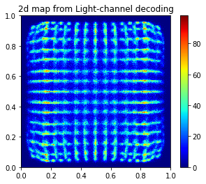
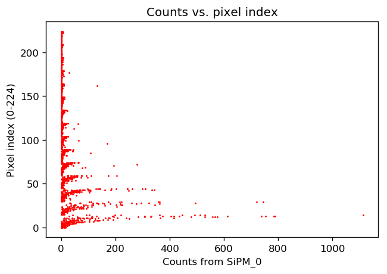

# Machine Learning technique on PET block detector development - Part 2-1

## Crystal/Pixel discrimination for DQS PET block detector using Machine Learning techniques (v1.0, 2019-09)
---


- This report describes the algorithm(s) to discrimanate the scintillation crystals (pixels) being fired by gammas in the block detectors
- The block under investigation is built using the Dichotomous Orthogonal Symmetry ([DOS](https://iopscience.iop.org/article/10.1088/0031-9155/61/4/1608)) design (https://iopscience.iop.org/article/10.1088/0031-9155/61/4/1608)
- The raw data is generated by Monte Carlo simulations using [GATE](http://www.opengatecollaboration.org/) (http://www.opengatecollaboration.org/)
- In order to read root file, the **uproot** package is needed ([link1](https://pypi.org/project/uproot/), [link2](https://github.com/scikit-hep/uproot)).
---


```python
# load libraries

import uproot
import numpy as np
import pandas as pd
import matplotlib.pyplot as plt
import matplotlib as mpl
# %matplotlib qt
%matplotlib inline
# %matplotlib notebook

import pickle
from sklearn.externals import joblib
import time

plt.rcParams['figure.dpi'] = 120 # default is 72
```

### 1. Raw data structure
***
- There are two TTree in the Monte Carlo simulation generated root file: **OpticalSinglesOpticaladder** and **SinglesAdder**.  
  Each tree consists of a series of records which has 26 fields:
  'runID',
  'eventID',
  'sourceID',
  'sourcePosX',
  'sourcePosY',
  'sourcePosZ',
  'time',  
  'energy',
  'globalPosX',
  'globalPosY',
  'globalPosZ',
  'gantryID',
  'rsectorID',
  'moduleID',
  'submoduleID',
  'crystalID',
  'layerID',  
  'comptonPhantom',
  'comptonCrystal',
  'RayleighPhantom',
  'RayleighCrystal',
  'axialPos',
  'rotationAngle',
  'comptVolName',  
  'RayleighVolName',
  'septalNb'.  
    
- The energy in the OpticalSinglesOpticaladder tree is the number of photons received by each photo sensors (SiPMs),  
while the energy in the SinglesAdder tree is the deposited energy (in MeV) at each interaction location inside the  
scintillation crystal pixels.  
  
- The records with the same runID and eventID in both the SinglesAdder and the OpticalSinglesOpticaladder trees are  
from the same gammas. Since each gamma may interact with the scintillator several times, and the photo sensors that  
received scintillation photons are different for each gamma, therefore, the number of records for the same gamma in the  
SinglesAdder and the OpticalSinglesOpticaladder are usually different. Therefore, sorting algorithms are needed to   
convert the raw data into a organized format for further investigation.  
---


```python
# load raw data from root files
file = "D:\\ML on PET block\\new_concept_block_lso\\new_concept_block_15x15\\results\\new_concept_block4a_planar_source001.root"
fp = uproot.open(file)

```


```python
fp.allkeys()
```


    [b'latest_event_ID;1',
     b'total_nb_primaries;1',
     b'OpticalSinglesOpticaladder;1',
     b'SinglesAdder;1']


```python
fp.allvalues()
```


    [<b'TH1D' b'latest_event_ID' 0x01cd8e8e1098>,
     <b'TH1D' b'total_nb_primaries' 0x01cd8e8c8a98>,
     <TTree b'OpticalSinglesOpticaladder' at 0x01cd8e8e8160>,
     <TTree b'SinglesAdder' at 0x01cd8f13f940>]


```python
fp.allitems()
```


    [(b'latest_event_ID;1', <b'TH1D' b'latest_event_ID' 0x01cd8e8c8f98>),
     (b'total_nb_primaries;1', <b'TH1D' b'total_nb_primaries' 0x01cd8e8c8db8>),
     (b'OpticalSinglesOpticaladder;1',
      <TTree b'OpticalSinglesOpticaladder' at 0x01cd8f7065c0>),
     (b'SinglesAdder;1', <TTree b'SinglesAdder' at 0x01cd91cf1da0>)]


```python
# optical singles adder consists of the photon counts received by each photo sensor
# sigles adder consists of the photon counts deposited at each interaction within the scintillator

opticalsinglesadder = fp["OpticalSinglesOpticaladder"]
singlesadder = fp["SinglesAdder"]

```


```python
singlesadder.show()
```

    runID                      (no streamer)              asdtype('>i4')
    eventID                    (no streamer)              asdtype('>i4')
    sourceID                   (no streamer)              asdtype('>i4')
    sourcePosX                 (no streamer)              asdtype('>f4')
    sourcePosY                 (no streamer)              asdtype('>f4')
    sourcePosZ                 (no streamer)              asdtype('>f4')
    time                       (no streamer)              asdtype('>f8')
    energy                     (no streamer)              asdtype('>f4')
    globalPosX                 (no streamer)              asdtype('>f4')
    globalPosY                 (no streamer)              asdtype('>f4')
    globalPosZ                 (no streamer)              asdtype('>f4')
    gantryID                   (no streamer)              asdtype('>i4')
    rsectorID                  (no streamer)              asdtype('>i4')
    moduleID                   (no streamer)              asdtype('>i4')
    submoduleID                (no streamer)              asdtype('>i4')
    crystalID                  (no streamer)              asdtype('>i4')
    layerID                    (no streamer)              asdtype('>i4')
    comptonPhantom             (no streamer)              asdtype('>i4')
    comptonCrystal             (no streamer)              asdtype('>i4')
    RayleighPhantom            (no streamer)              asdtype('>i4')
    RayleighCrystal            (no streamer)              asdtype('>i4')
    axialPos                   (no streamer)              asdtype('>f4')
    rotationAngle              (no streamer)              asdtype('>f4')
    comptVolName               (no streamer)              asstring()
    RayleighVolName            (no streamer)              asstring()
    septalNb                   (no streamer)              asdtype('>i4')
    


```python
opticalsinglesadder.show()
```

    runID                      (no streamer)              asdtype('>i4')
    eventID                    (no streamer)              asdtype('>i4')
    sourceID                   (no streamer)              asdtype('>i4')
    sourcePosX                 (no streamer)              asdtype('>f4')
    sourcePosY                 (no streamer)              asdtype('>f4')
    sourcePosZ                 (no streamer)              asdtype('>f4')
    time                       (no streamer)              asdtype('>f8')
    energy                     (no streamer)              asdtype('>f4')
    globalPosX                 (no streamer)              asdtype('>f4')
    globalPosY                 (no streamer)              asdtype('>f4')
    globalPosZ                 (no streamer)              asdtype('>f4')
    gantryID                   (no streamer)              asdtype('>i4')
    rsectorID                  (no streamer)              asdtype('>i4')
    moduleID                   (no streamer)              asdtype('>i4')
    submoduleID                (no streamer)              asdtype('>i4')
    crystalID                  (no streamer)              asdtype('>i4')
    layerID                    (no streamer)              asdtype('>i4')
    comptonPhantom             (no streamer)              asdtype('>i4')
    comptonCrystal             (no streamer)              asdtype('>i4')
    RayleighPhantom            (no streamer)              asdtype('>i4')
    RayleighCrystal            (no streamer)              asdtype('>i4')
    axialPos                   (no streamer)              asdtype('>f4')
    rotationAngle              (no streamer)              asdtype('>f4')
    comptVolName               (no streamer)              asstring()
    RayleighVolName            (no streamer)              asstring()
    septalNb                   (no streamer)              asdtype('>i4')
    


```python
opticalsinglesadder.name, opticalsinglesadder.title, opticalsinglesadder.numbranches, opticalsinglesadder.numentries
```


    (b'OpticalSinglesOpticaladder', b'The root tree for singles', 26, 8064316)


```python
singlesadder.name, singlesadder.title, singlesadder.numbranches, singlesadder.numentries
```


    (b'SinglesAdder', b'The root tree for singles', 26, 446353)


###  
### 2. Sorting the raw data
***
- A C-like code for Root is developed sorting and filtering the raw events and converting them into a more straight forward  
data structure. The converted data is stored using CSV format as ASCII file.

- The number of fields in the CSV is determined by the structure of the simulated block detector. For the 15 $\times$ 15 LSO  
block in this study, the number of fields is $N_s\times4+4$, where $N_s=9$ is the number of photo sensors along one side of the block.


- The first 3 fields are the "index_x","index_y","index_z", which is the pixel index in X, Y and Z direction. The pixel index in X and Y  
direction are the real pixel/crystal index, however, the pixle/crystal along Z direction is one complete unit in this simualtion.  
Thus the Z index is the discreted index based on delta_z parameter during the sorting.  
  
- The fourth field is the total deposited energy by the gamma in MeV unit.  

- The rest of the fields are the number of photons received by each photo sensors. The first $N_s\times2$ fields are for the sensors on  
the top: "$st0$" to "$st[N_s\times2-1]$", the second $N_s\times2$ fields are the for the sensors on the bottom: "$sb0$" to "$sb[N_s\times2-1]$". 
  
---


```python
file = "D:\\ML on PET block\\new_concept_block_lso\\new_concept_block_15x15\\results\\ML_data\\new_concept_block_15x15_sorted_events1.csv"

df0 = pd.read_csv (file, comment='#')
```


```python
df0.head()

```


<div>
<style scoped>
    .dataframe tbody tr th:only-of-type {
        vertical-align: middle;
    }

    .dataframe tbody tr th {
        vertical-align: top;
    }

    .dataframe thead th {
        text-align: right;
    }
</style>
<table border="1" class="dataframe">
  <thead>
    <tr style="text-align: right;">
      <th></th>
      <th>index_x</th>
      <th>index_y</th>
      <th>index_z</th>
      <th>energy</th>
      <th>st0</th>
      <th>st1</th>
      <th>st2</th>
      <th>st3</th>
      <th>st4</th>
      <th>st5</th>
      <th>...</th>
      <th>sb8</th>
      <th>sb9</th>
      <th>sb10</th>
      <th>sb11</th>
      <th>sb12</th>
      <th>sb13</th>
      <th>sb14</th>
      <th>sb15</th>
      <th>sb16</th>
      <th>sb17</th>
    </tr>
  </thead>
  <tbody>
    <tr>
      <th>0</th>
      <td>8</td>
      <td>3</td>
      <td>5</td>
      <td>0.511000</td>
      <td>10</td>
      <td>1</td>
      <td>38</td>
      <td>1</td>
      <td>45</td>
      <td>2</td>
      <td>...</td>
      <td>6</td>
      <td>91</td>
      <td>4</td>
      <td>16</td>
      <td>5</td>
      <td>12</td>
      <td>1</td>
      <td>10</td>
      <td>1</td>
      <td>4</td>
    </tr>
    <tr>
      <th>1</th>
      <td>9</td>
      <td>9</td>
      <td>2</td>
      <td>0.481130</td>
      <td>5</td>
      <td>1</td>
      <td>5</td>
      <td>4</td>
      <td>6</td>
      <td>2</td>
      <td>...</td>
      <td>19</td>
      <td>4</td>
      <td>93</td>
      <td>0</td>
      <td>33</td>
      <td>2</td>
      <td>10</td>
      <td>0</td>
      <td>7</td>
      <td>0</td>
    </tr>
    <tr>
      <th>2</th>
      <td>5</td>
      <td>2</td>
      <td>6</td>
      <td>0.511000</td>
      <td>6</td>
      <td>0</td>
      <td>24</td>
      <td>0</td>
      <td>4</td>
      <td>2</td>
      <td>...</td>
      <td>2</td>
      <td>44</td>
      <td>4</td>
      <td>175</td>
      <td>1</td>
      <td>62</td>
      <td>0</td>
      <td>27</td>
      <td>0</td>
      <td>6</td>
    </tr>
    <tr>
      <th>3</th>
      <td>7</td>
      <td>6</td>
      <td>8</td>
      <td>0.511000</td>
      <td>3</td>
      <td>2</td>
      <td>1</td>
      <td>2</td>
      <td>7</td>
      <td>2</td>
      <td>...</td>
      <td>6</td>
      <td>34</td>
      <td>5</td>
      <td>7</td>
      <td>0</td>
      <td>8</td>
      <td>1</td>
      <td>5</td>
      <td>1</td>
      <td>2</td>
    </tr>
    <tr>
      <th>4</th>
      <td>2</td>
      <td>3</td>
      <td>9</td>
      <td>0.332283</td>
      <td>0</td>
      <td>4</td>
      <td>1</td>
      <td>7</td>
      <td>9</td>
      <td>3</td>
      <td>...</td>
      <td>1</td>
      <td>3</td>
      <td>1</td>
      <td>6</td>
      <td>0</td>
      <td>24</td>
      <td>0</td>
      <td>46</td>
      <td>0</td>
      <td>30</td>
    </tr>
  </tbody>
</table>
<p>5 rows × 40 columns</p>
</div>


```python
X = df0.iloc[:,4:].values
```


```python
decoding = df0.iloc[:,0:4].values
```


```python
# total energy per event in term of photon count
E_photon = np.sum(X, axis=1)

```

###  
### 3. Energy Spectrum

---


```python
# check the energy spectrum in term of the tatal photon count from all events
fig, ax = plt.subplots()
#ax.set_xlim(min(E_photon), max(E_photon))
#plt.hist(E_photon, bins=200, range=(min(E_photon),max(E_photon)), histtype = 'step')
plt.hist(E_photon, bins=200, histtype = 'step')
ax.set_title("Energy spectrum from photon counts")
plt.savefig(".\\figs2\\Energy_spectrum_from_photon_counts.png", dpi=300)
```


```python
# check the energy spectrum in term of the tatal deposited energy (MeV)
fig, ax = plt.subplots()
# ax.set_xlim(min(E_photon), max(E_photon))
plt.hist(decoding[:,3], bins=200, histtype = 'step')
ax.set_title("Energy spectrum from deposited energy (MeV)")
plt.savefig(".\\figs2\\Energy_spectrum_from_deposited_energy.png", dpi=300)
```


###  
### 4. Conventional decoding methods and the associated 2D maps  
 \* For the details of the docoding algorithms please refer to the publication [A novel depth-of-interaction block detector for positron emission tomography using a dichotomous orthogonal sysmetry decoding concept](https://iopscience.iop.org/article/10.1088/0031-9155/61/4/1608).

***

#### 4.1 Anger-position decoding


```python
E_top = X[:,0:18]
E_bottom = X[:,18:36]

E_x1 = E_top[:, 0:18:2]
E_x2 = E_top[:, 18:0:-2]

E_y1 = E_bottom[:, 0:18:2]
E_y2 = E_bottom[:, 18:0:-2]
```


```python
E_left = np.sum(E_x1, axis = 1)
E_right = np.sum(E_x2, axis = 1)

E_front = np.sum(E_y1, axis = 1)
E_back = np.sum(E_y2, axis = 1)
```


```python
E_h = E_left + E_right
E_h[E_h==0] = 1

E_v = E_front + E_back
E_v[E_v==0] = 1
```


```python
x_t = np.array(E_left / E_h)
y_t = np.array(E_front / E_v)

#x_t[np.isnan(x_t)] = 0
#y_t[np.isnan(y_t)] = 0
```


```python
fig, ax = plt.subplots(nrows=1, ncols=2,figsize=(12,4))

#ax.set_title('2d map from anger decoding')
ax[0].hist(x_t, bins=256)
ax[1].hist(y_t, bins=256)

plt.show()
```


```python
fig, ax = plt.subplots(figsize=(4.8,4))

ax.set_title('2d map from Anger decoding')
#im = ax.hist2d(x_t, y_t, bins=256, cmap=mpl.cm.jet, cmin=0, cmax=2000)
im = ax.hist2d(x_t, y_t, bins=256, norm = mpl.colors.LogNorm(), cmap=mpl.cm.jet)
fig.colorbar(im[3], ax=ax)
plt.show()
plt.savefig(".\\figs2\\2d_map_anger_decoding.png", dpi=300)
```


    <Figure size 432x288 with 0 Axes>


#### 4.2 Light-channel decoding


```python
t0 = E_y1[:,0] + E_y2[:,0]

for j in range(1,9):
    t0 += (E_y1[:,j] + E_y2[:,j]) * (j+1)

x_b = np.array((t0 / (E_front+E_back) - 1) / 8)
x_b[np.isnan(x_b)] = 0
```

    C:\ProgramData\Anaconda3\lib\site-packages\ipykernel_launcher.py:6: RuntimeWarning: invalid value encountered in true_divide
      
    


```python
t0 = E_x1[:,0] + E_x2[:,0]

for j in range(1,9):
    t0 += (E_x1[:,j] + E_x2[:,j]) * (j+1)

y_b = np.array((t0 / (E_left+E_right) - 1) / 8)
y_b[np.isnan(y_b)] = 0
```

    C:\ProgramData\Anaconda3\lib\site-packages\ipykernel_launcher.py:6: RuntimeWarning: invalid value encountered in true_divide
      
    


```python
fig, ax = plt.subplots(figsize=(4.8,4))

ax.set_title('2d map from Light-channel decoding')

im = ax.hist2d(x_b, y_b, bins=256, cmap=mpl.cm.jet, cmin=0, cmax=100)
fig.colorbar(im[3], ax=ax)

plt.show()
plt.savefig(".\\figs2\\2d_map_light_channel_decoding.png", dpi=300)
```





    <Figure size 432x288 with 0 Axes>


#### 4.3 Composite decoding

##### 4.3.1 arithmetic mean


```python
# x, y scale normalized to 1024
x_a =  (x_t + x_b) / 2 
y_a =  (y_t + y_b) / 2

fig, ax = plt.subplots(figsize=(4.8,4))
ax.set_title('2d map from arithmetic mean')
im = ax.hist2d(x_a, y_a, bins=256, cmap=mpl.cm.jet, cmin=0, cmax=150)
fig.colorbar(im[3], ax=ax)
plt.savefig(".\\figs2\\2d_map_arithmetic_mean.png", dpi=300)
plt.show()

```


##### 4.3.2 geometric mean


```python
x_g = np.sqrt(x_t * x_b)
y_g = np.sqrt(y_t * y_b) 

fig, ax = plt.subplots(figsize=(4.8,4))
ax.set_title('2d map from geometric mean')
im = ax.hist2d(x_g, y_g, bins=256, cmap=mpl.cm.jet, cmin=0, cmax=150)
fig.colorbar(im[3], ax=ax)
plt.savefig(".\\figs2\\2d_map_geometric_mean.png", dpi=300)
plt.show()

```


##### 4.3.3 Complex weight function


```python
w = 1 - 0.7 * np.sqrt( (x_b-0.5)**2 + (y_b-0.5)**2 ) / 0.707
x_c = x_b * w + x_t * (1-w)
y_c = y_b * w + y_t * (1-w)

fig, ax = plt.subplots(figsize=(4.8,4))
ax.set_title('2d map from complex weight function')
im = ax.hist2d(x_c, y_c, bins=256, cmap=mpl.cm.jet, cmin=0, cmax=100)
fig.colorbar(im[3], ax=ax)
plt.savefig(".\\figs2\\2d_map_comp_weight.png", dpi=300)
plt.show()

```


```python
#histgram2d, xedges, yedges = np.histogram2d(x_c, y_c, bins=256, range=[[0,256],[0,256]])
histgram2d, xedges, yedges = np.histogram2d(y_c, x_c, bins=256, range=[[0,1],[0,1]])
im = plt.imshow(histgram2d, cmap='jet', vmax=100, vmin=0)
fig = plt.gcf()
ax = plt.gca()
fig.colorbar(im, ax=ax)
plt.title('2dmap from complex weight function')
plt.savefig(".//figs2//2d_map_comp_wight_1.png", dpi=300)
```


####  
#### 4.4  Scintillator/pixel discrimination using lookup table 


##### 4.4.1 Load the lookup table previously generated by conventional method based on the complex weight function


```python
# read the 2D map
# twoD_map_datatype 
# big endian using '>'
twoD_map_datatype = np.dtype('>u4')

file = "D:\\ML on PET block\\new_concept_block_lso\\new_concept_block_15x15\\results\\new_concept_block4a_planar_source_comp1_bigendian_lut2.dat"
lut = np.fromfile(file, dtype=twoD_map_datatype).reshape((256,256))

fig1 = plt.imshow(lut, cmap='prism')
plt.title('Lookup map from loaded 2dmap file')
plt.savefig(".\\figs2\\lut_from_lut_file.png", dpi=300)

```


#####  
##### 4.4.2 Generate grid from the lookup table


```python
# check the description in Part 1.

def generate_grid(lut):
    """
    generate the grid of the lookup table from the lookup table data
    
    input: lookup table, numpy array
    output: grid as numpy array, the same size as the input 
    """
    
    lut_grid = np.zeros(lut.shape)
    pix_x, pix_y = lut_grid.shape

    for i in range(pix_x-1):
        for j in range(pix_y-1):
            if lut[i,j] != lut[i+1,j]:
                lut_grid[i,j] = 1
                lut_grid[i+1,j] = 1
            if lut[i,j] != lut[i,j+1]:
                lut_grid[i,j] = 1
                lut_grid[i,j+1] = 1
    
    return lut_grid
```


```python
lut_grid = generate_grid(lut)

plt.imshow(lut_grid, cmap="gray")
plt.title("LUT grid generated from lut file")
plt.savefig(".\\figs2\\lut_grid_generated_from_lut_file.png", dpi=300)
```


#####  
##### 4.4.3 Overlap the lut grid with the 2dmap (histogram)


```python
#fig, ax = plt.subplots(nrows=1, ncols=2,figsize=(12,4))
plt.rcParams['figure.dpi'] = 150

#plt.imshow(np.flip(histgram2d, axis=1), vmax = 100, cmap='jet')
plt.imshow(histgram2d, vmax = 100, cmap='jet')
plt.imshow(lut_grid, cmap="gray", alpha=0.5)
plt.title("2dmap and LUT grid from original file")
plt.savefig(".\\figs2\\2dmap_and_lut_grid_from_original_file.png", dpi=300)

plt.rcParams['figure.dpi'] = 120
```


####  
#### 4.4.4 Scintillator/pixel discrimination using lookup table


```python
# deduce index_i and index_j from LUT

index_i=((lut/1000)-1).astype(int); # row index (Y)
index_j=lut%1000-1; # cloumn index (X)

```

* <b>define pixel_xy as the unique pixel/scintillator index in the 2d block as</b>
```
pixel_xy = index_y * 15 + index_x
```


```python
pixel_xy = np.array(df0['index_y'] * 15 + df0['index_x'])
plt.hist(pixel_xy, bins=225, histtype = 'step')
plt.show
```


    <function matplotlib.pyplot.show(*args, **kw)>


```python
def check_decoding (decoded_coor_x, decoded_coor_y, lut_index_i, lut_index_j, pixel_xy):
    '''
    check the decoding accuracy
    
    input decoded_coor_x, 
          decoded_coor_y: decoded x, y coordinates, range [0, 1], 1d float array, respectively
    input lut_index_i,
          lut_index_j: lookup table, 2D 256 x 256 array, resepectively,
                         decoded_index_x = lut_index_i[pixel_x *255, pixel_y*255]
                         decoded_index_y = lut_index_j[pixel_x *255, pixel_y*255]
    input pixel_xy : true index, pixel_xy = index_y * 15 + index_x
    
    decoded_xy = decoded_index_y * 15 + decoded_index_x

    output accuracy: sum(decoded_xy == pixel_xy) / pixel_xy.size
    '''
   
    decoded_index_y = lut_index_i[(decoded_coor_y * 255).astype(int), (decoded_coor_x * 255).astype(int)]
    decoded_index_x = lut_index_j[(decoded_coor_y * 255).astype(int), (decoded_coor_x * 255).astype(int)]

    decoded_xy =  np.array(decoded_index_y * 15 + decoded_index_x)
        
    #print (sum(decoded_xy == pixel_xy), pixel_xy.size)
    accuracy = sum(decoded_xy == pixel_xy) / pixel_xy.size

    return accuracy, decoded_xy
    
    
```


```python
#m=1000000
m=pixel_xy.size
accu, decoded_xy = check_decoding(x_c[:m], y_c[:m], index_i, index_j, pixel_xy[:m])
```


```python
accu
```


    0.5217637443686959


* <b>Therefore, the decoding accuracy with the lookup table is 0.522.</b>
***

###  
### 5. Scintillator/Pixel discrimination using ML algorithms - Part I, regression algorithms
***

####  
#### 5.1 pixel index vs. individual SiPM counts


```python
N=3000
plt.scatter(X[:N,0], pixel_xy[0:N], color = 'red', s=0.5)
plt.title('Counts vs. pixel index')
plt.xlabel('Counts from SiPM_0')
plt.ylabel('Pixel index (0-224)')
plt.show
```


    <function matplotlib.pyplot.show(*args, **kw)>





```python
N=3000
plt.scatter(X[:N,0], df0['index_x'][0:N], color = 'red', s=0.5)
plt.title('Counts from SiPM_0 vs. pixel index_x')
plt.xlabel('Counts from SiPM_0')
plt.ylabel('Pixel index_x (0-14)')
plt.show
```


    <function matplotlib.pyplot.show(*args, **kw)>


* <b>Pixel index does not have simple relationship to individual SiPM counts!</b>

####  
#### 5.2 pixel index vs. combined SiPM counts


```python
# E_left, E_right, E_front， E_back

# Anger decoding
# x_t, y_t

# light channel docoding
# x_b, y_b
N=3000

fig, ax = plt.subplots(1,2,figsize=(10,4))
ax[0].title.set_text('Anger decoding')
ax[0].scatter(x_t[:N], df0['index_x'][0:N], color = 'red', s=0.5)
ax[0].scatter(y_t[:N], df0['index_y'][0:N]+0.5, color = 'blue', s=0.5)
ax[0].set(xlabel='x_t, y_t', ylabel='index_x (red) and index_y (blue)')

ax[1].title.set_text('Light channel decoding')
ax[1].scatter(x_b[:N], df0['index_x'][0:N], color = 'red', s=0.5)
ax[1].scatter(y_b[:N], df0['index_y'][0:N]+0.5, color = 'blue', s=0.5)
ax[1].set(xlabel='x_b, y_b', ylabel='index_x (red) and index_y (blue)')

```


    [Text(0, 0.5, 'index_x (red) and index_y (blue)'), Text(0.5, 0, 'x_b, y_b')]


* <b>Pixel index have a monotonic relationship to the combined SiPM counts, therefore, regression or classification algorithms might work!</b>

####  
#### 5.3 pixel discrimination using regression algorithms - using pixel index as the only one output


```python
#==============================================================================
# split the dataset into training and test set use 80/20 approach
#==============================================================================

from sklearn.model_selection import train_test_split

index = np.arange(X[:,0].size)
X_train, X_test, pixel_xy_train, pixel_xy_test, index_train, index_test = \
        train_test_split (X, pixel_xy, index, test_size = 0.2, random_state = 0)

```


```python
accu, decoded_xy = check_decoding(x_c[index_test], y_c[index_test], index_i, index_j, pixel_xy[index_test])
print ('accuracy for the testing data is %f.'%accu)
```

    accuracy for the testing data is 0.521898.
    


```python
accu, decoded_xy = check_decoding(x_c[index_train], y_c[index_train], index_i, index_j, pixel_xy[index_train])
print ('accuracy for the trainning data is %f.'%accu)
```

    accuracy for the trainning data is 0.521730.
    

#####  
##### 5.3.1 linear regression


```python
from sklearn.linear_model import LinearRegression
lin_reg = LinearRegression()
lin_reg.fit(X_train, pixel_xy_train)
lin_reg.intercept_, lin_reg.coef_
```


    (112.10517366517637,
     array([-0.06849888,  0.06806856, -0.06789525,  0.06890463, -0.0524121 ,
             0.05115546, -0.02265603,  0.02334874,  0.00681716, -0.00731927,
             0.03822236, -0.03849436,  0.06498417, -0.06435202,  0.07922839,
            -0.08078829,  0.0750127 , -0.07471007,  0.06775116, -0.06825595,
             0.10364466, -0.10571765,  0.12718253, -0.12789485,  0.13836742,
            -0.14103274,  0.13603968, -0.13577657,  0.14183952, -0.14499515,
             0.1385801 , -0.13581617,  0.11918745, -0.1198089 ,  0.08437269,
            -0.08250363]))


```python
y_pred = lin_reg.predict(X_test)
```


```python
y_pred.astype(int)
```


    array([167,  72,  86, ..., 158, 106,  68])


```python
(y_pred+0.5).astype(int)
```


    array([168,  73,  87, ..., 159, 106,  68])


```python
pixel_xy_test
```


    array([187,  10,  77, ..., 217,  49,  71], dtype=int64)


```python
accu_lin_reg = sum(pixel_xy_test==y_pred.astype(int))/pixel_xy_test.size
print('accuracy from linear regression: %f'%accu_lin_reg)
```

    accuracy from linear regression: 0.029325
    


```python
accu_lin_reg = sum(pixel_xy_test==(y_pred+0.5).astype(int))/pixel_xy_test.size
print('accuracy from linear regression: %f'%accu_lin_reg)
```

    accuracy from linear regression: 0.029267
    

* <b>The accuracy from linear regression is unacceptable!</b>

#####  
##### 5.3.2 polynomial regression using original SiPM counts


```python
from sklearn.preprocessing import PolynomialFeatures
poly_features = PolynomialFeatures(degree=3, include_bias=False)
N=10000
X_train_poly = poly_features.fit_transform(X_train[:N])
```


```python
X_test_poly = poly_features.transform(X_test)
```


```python
lin_reg2 = LinearRegression()
lin_reg2.fit(X_train_poly, pixel_xy_train[:N])
```


    LinearRegression(copy_X=True, fit_intercept=True, n_jobs=None,
             normalize=False)


```python
pixel_xy_poly_pred = lin_reg2.predict(X_test_poly)
```


```python
accu_poly_reg = sum(pixel_xy_test==pixel_xy_poly_pred.astype(int))/pixel_xy_test.size
print('accuracy from polynomial regression: %f'%accu_poly_reg)
```

    accuracy from polynomial regression: 0.005550
    


```python
accu_poly_reg = sum(pixel_xy_test==(pixel_xy_poly_pred+0.5).astype(int))/pixel_xy_test.size
print('accuracy from polynomial regression: %f'%accu_poly_reg)
```

    accuracy from polynomial regression: 0.005395
    

* <b>Polynomial(degree=2), accuracy = 0.064714</b>
* <b>Polynomial(degree=3), the polynmial fit_transform function will run out of memory with the whole training data set with 16GB memory under Windows 10, therefore, we limited the training data set size to 10000, and the accuracy = 0.005550, basically unacceptable.</b>

#####  
#####  5.3.3 polynomial regression using Anger decoding (x_t, y_t) or Light Channel decoding signal (x_b, y_b)


```python
# Ander decoding using x_t, y_t

poly_features2 = PolynomialFeatures(degree=9, include_bias=False)
X_t = np.hstack((x_t.reshape(-1,1), y_t.reshape(-1,1)))
X_train2 = X_t[index_train]
X_test2 = X_t[index_test] 
X_train2_poly = poly_features2.fit_transform(X_train2)
X_test2_poly = poly_features2.transform(X_test2)
```


```python
lin_reg_t = LinearRegression()
lin_reg_t.fit(X_train2_poly, pixel_xy_train)
```


    LinearRegression(copy_X=True, fit_intercept=True, n_jobs=None,
             normalize=False)


```python
pixel_xy_poly2_pred = lin_reg_t.predict(X_test2_poly)

accu_poly_reg = sum(pixel_xy_test==pixel_xy_poly2_pred.astype(int))/pixel_xy_test.size
print('accuracy from polynomial regression: %f'%accu_poly_reg)

accu_poly_reg = sum(pixel_xy_test==(pixel_xy_poly2_pred+0.5).astype(int))/pixel_xy_test.size
print('accuracy from polynomial regression: %f'%accu_poly_reg)

```

    accuracy from polynomial regression: 0.053161
    accuracy from polynomial regression: 0.053777
    

* <b>Polynomial(degree=3), accuracy = 0.045803</b>
* <b>Polynomial(degree=4), accuracy = 0.045715</b>
* <b>Polynomial(degree=5), accuracy = 0.051886</b>
* <b>Polynomial(degree=9), accuracy = 0.053161</b>


```python

# light decoding using x_b, y_b

poly_features2 = PolynomialFeatures(degree=21, include_bias=False)
X_b = np.hstack((x_b.reshape(-1,1), y_b.reshape(-1,1)))
X_train2 = X_b[index_train]
X_test2 = X_b[index_test] 
X_train2_poly = poly_features2.fit_transform(X_train2)
X_test2_poly = poly_features2.transform(X_test2)

lin_reg_b = LinearRegression()
lin_reg_b.fit(X_train2_poly, pixel_xy_train)


pixel_xy_poly2_pred = lin_reg_b.predict(X_test2_poly)

accu_poly_reg = sum(pixel_xy_test==pixel_xy_poly2_pred.astype(int))/pixel_xy_test.size
print('accuracy from polynomial regression: %f'%accu_poly_reg)

accu_poly_reg = sum(pixel_xy_test==(pixel_xy_poly2_pred+0.5).astype(int))/pixel_xy_test.size
print('accuracy from polynomial regression: %f'%accu_poly_reg)
```

    accuracy from polynomial regression: 0.083877
    accuracy from polynomial regression: 0.088125
    

* <b>Polynomial(degree=3), accuracy = 0.067173</b>
* <b>Polynomial(degree=5), accuracy = 0.072440</b>
* <b>Polynomial(degree=7), accuracy = 0.074278</b>
* <b>Polynomial(degree=9), accuracy = 0.075022</b>
* <b>Polynomial(degree=15), accuracy = 0.081547</b>


```python

# composite decoding x_a, y_a

X_a = np.hstack((x_a.reshape(-1,1), y_a.reshape(-1,1)))
X_train2 = X_a[index_train]
X_test2 = X_a[index_test] 

for i in (2,3,5,7,9,15,21):
    poly_features2 = PolynomialFeatures(degree=i, include_bias=False)

    X_train2_poly = poly_features2.fit_transform(X_train2)
    X_test2_poly = poly_features2.transform(X_test2)

    lin_reg_a = LinearRegression()
    lin_reg_a.fit(X_train2_poly, pixel_xy_train)


    pixel_xy_poly2_pred = lin_reg_a.predict(X_test2_poly)

    accu_poly_reg = sum(pixel_xy_test==(pixel_xy_poly2_pred+.5).astype(int))/pixel_xy_test.size
    print('accuracy from polynomial regression (degree=%d): %f' % (i,accu_poly_reg))

#    accu_poly_reg = sum(pixel_xy_test==(pixel_xy_poly2_pred+0.5).astype(int))/pixel_xy_test.size
#    print('accuracy from polynomial regression: %f'%accu_poly_reg)
```

    accuracy from polynomial regression (degree=2): 0.023938
    accuracy from polynomial regression (degree=3): 0.071700
    accuracy from polynomial regression (degree=5): 0.072338
    accuracy from polynomial regression (degree=7): 0.074654
    accuracy from polynomial regression (degree=9): 0.075536
    accuracy from polynomial regression (degree=15): 0.078902
    accuracy from polynomial regression (degree=21): 0.080019
    
accuracy from polynomial regression (degree=2): 0.023938
accuracy from polynomial regression (degree=3): 0.071700
accuracy from polynomial regression (degree=5): 0.072338
accuracy from polynomial regression (degree=7): 0.074654
accuracy from polynomial regression (degree=9): 0.075536
accuracy from polynomial regression (degree=15): 0.078902
accuracy from polynomial regression (degree=21): 0.080019

```python

# composite decoding x_g, y_g
X_g = np.hstack((x_g.reshape(-1,1), y_g.reshape(-1,1)))
X_train2 = X_g[index_train]
X_test2 = X_g[index_test] 

for i in (2,3,5,7,9,15):
    poly_features2 = PolynomialFeatures(degree=i, include_bias=False)

    X_train2_poly = poly_features2.fit_transform(X_train2)
    X_test2_poly = poly_features2.transform(X_test2)

    lin_reg_g = LinearRegression()
    lin_reg_g.fit(X_train2_poly, pixel_xy_train)


    pixel_xy_poly2_pred = lin_reg_g.predict(X_test2_poly)

    accu_poly_reg = sum(pixel_xy_test==(pixel_xy_poly2_pred+0.5).astype(int))/pixel_xy_test.size
    print('accuracy from polynomial regression (degree=%d): %f' % (i,accu_poly_reg))


```

    accuracy from polynomial regression (degree=2): 0.024519
    accuracy from polynomial regression (degree=3): 0.066738
    accuracy from polynomial regression (degree=5): 0.069241
    accuracy from polynomial regression (degree=7): 0.068674
    accuracy from polynomial regression (degree=9): 0.068555
    accuracy from polynomial regression (degree=15): 0.078477
    


```python

# complex weight function decoding x_c, y_c

X_c = np.hstack((x_c.reshape(-1,1), y_c.reshape(-1,1)))
X_train2 = X_c[index_train]
X_test2 = X_c[index_test] 

for i in (2,3,5,7,9,15):
    poly_features2 = PolynomialFeatures(degree=i, include_bias=False)

    X_train2_poly = poly_features2.fit_transform(X_train2)
    X_test2_poly = poly_features2.transform(X_test2)

    lin_reg_c = LinearRegression()
    lin_reg_c.fit(X_train2_poly, pixel_xy_train)


    pixel_xy_poly2_pred = lin_reg_c.predict(X_test2_poly)

    accu_poly_reg = sum(pixel_xy_test==(pixel_xy_poly2_pred+0.5).astype(int))/pixel_xy_test.size
    print('accuracy from polynomial regression (degree=%d): %f' % (i,accu_poly_reg))

```

    accuracy from polynomial regression (degree=2): 0.046951
    accuracy from polynomial regression (degree=3): 0.071026
    accuracy from polynomial regression (degree=5): 0.077281
    accuracy from polynomial regression (degree=7): 0.078003
    accuracy from polynomial regression (degree=9): 0.078801
    accuracy from polynomial regression (degree=15): 0.082610
    

####  
#### 5.4 pixel discrimination using regression algorithms - using seperated x and y indices as the output

#####  
##### 5.4.0 plot prediction result


```python
from sklearn.utils import check_random_state

def random_cmap(ncolors=256, random_state=None):
    """
    Generate a matplotlib colormap consisting of random (muted) colors.

    A random colormap is very useful for plotting segmentation images.

    Parameters
    ----------
    ncolors : int, optional
        The number of colors in the colormap.  The default is 256.

    random_state : int or `~numpy.random.RandomState`, optional
        The pseudo-random number generator state used for random
        sampling.  Separate function calls with the same
        ``random_state`` will generate the same colormap.

    Returns
    -------
    cmap : `matplotlib.colors.Colormap`
        The matplotlib colormap with random colors.
    """

    from matplotlib import colors

    prng = check_random_state(random_state)
    h = prng.uniform(low=0.0, high=1.0, size=ncolors)
    s = prng.uniform(low=0.4, high=0.9, size=ncolors)
    v = prng.uniform(low=0.7, high=1.0, size=ncolors)
    hsv = np.dstack((h, s, v))
    rgb = np.squeeze(colors.hsv_to_rgb(hsv))

    return colors.ListedColormap(rgb)
```


```python
def plot_prediction_boundary(reg_func1, reg_func2, prep_func, cmap='hsv', axes=[0, 1.0, 0, 1.0], legend=False):
    fig, ax = plt.subplots(figsize=(4,4))
    
    x1s = np.linspace(axes[0], axes[1], 256)
    x2s = np.linspace(axes[2], axes[3], 256)
    x1, x2 = np.meshgrid(x1s, x2s)
    X_new = np.c_[x1.ravel(), x2.ravel()]
    y1_pred = (reg_func1.predict(prep_func.transform(X_new))+0.5).astype(int).reshape(x1.shape)
    y2_pred = (reg_func2.predict(prep_func.transform(X_new))+0.5).astype(int).reshape(x1.shape)

    lut_pred = y1_pred+y2_pred*15
    plt.imshow(lut_pred, alpha=0.5, cmap=cmap)
    
    return lut_pred
    
```

#####  
##### 5.4.1 polynomial regression


```python
# pixel_xy = np.array(df0['index_y'] * 15 + df0['index_x'])
pixel_x = np.array(df0['index_x'])
pixel_y = np.array(df0['index_y'])

pixel_x_train = pixel_x[index_train]
pixel_y_train = pixel_y[index_train]

pixel_x_test = pixel_x[index_test]
pixel_y_test = pixel_y[index_test]

```


```python

# Anger decoding x_t, y_t

X_t = np.hstack((x_t.reshape(-1,1), y_t.reshape(-1,1)))
X_train = X_t[index_train]
X_test = X_t[index_test] 

#for i in (1,2,3,4,5,6,7,9,11,15):
for i in (1,3,5,7):

    poly_features = PolynomialFeatures(degree=i, include_bias=False)

    X_train_poly = poly_features.fit_transform(X_train)
    X_test_poly = poly_features.transform(X_test)

    lin_reg_a_x = LinearRegression()
    lin_reg_a_y = LinearRegression()
    lin_reg_a_x.fit(X_train_poly, pixel_x_train)
    lin_reg_a_y.fit(X_train_poly, pixel_y_train)


    pixel_x_pred = lin_reg_a_x.predict(X_test_poly)
    pixel_y_pred = lin_reg_a_y.predict(X_test_poly)

    accu_poly_reg = sum(np.logical_and(pixel_x_test==(pixel_x_pred+.5).astype(int), pixel_y_test==(pixel_y_pred+.5).astype(int))) / pixel_x_test.size
    print('accuracy from polynomial regression (degree=%d): %f' % (i,accu_poly_reg))
    
```

    accuracy from polynomial regression (degree=1): 0.071726
    accuracy from polynomial regression (degree=3): 0.319765
    accuracy from polynomial regression (degree=5): 0.452626
    accuracy from polynomial regression (degree=7): 0.475891
    

<b>
accuracy from polynomial regression (degree=1): 0.071726  
 
accuracy from polynomial regression (degree=2): 0.071775  
accuracy from polynomial regression (degree=3): 0.319765  
accuracy from polynomial regression (degree=4): 0.319774  
accuracy from polynomial regression (degree=5): 0.452626  
accuracy from polynomial regression (degree=6): 0.452604  
accuracy from polynomial regression (degree=7): 0.475891  
accuracy from polynomial regression (degree=9): 0.474314  
accuracy from polynomial regression (degree=11): 0.471275  
accuracy from polynomial regression (degree=15): 0.487989  
</b>


```python
lut_pred = plot_prediction_boundary(lin_reg_a_x, lin_reg_a_y, poly_features, cmap='prism', axes=[0, 1.0, 0, 1.0], legend=False)
plt.gcf()
plt.title("Prediction with Anger decoding")
plt.savefig(".\\figs2\\Prediction_with_Anger_decoding.png", dpi=300)

plt.figure()
plt.imshow(generate_grid(lut_pred), cmap='gray')
plt.savefig(".\\figs2\\Prediction_with_Anger_decoding_grid.png", dpi=300)

```


```python

# light channel decoding x_b, y_b

X_b = np.hstack((x_b.reshape(-1,1), y_b.reshape(-1,1)))
X_train = X_b[index_train]
X_test = X_b[index_test] 

#for i in (1,2,3,4,5,6,7,8):
for i in (3,4,5,6,7):
    poly_features = PolynomialFeatures(degree=i, include_bias=False)

    X_train_poly = poly_features.fit_transform(X_train)
    X_test_poly = poly_features.transform(X_test)

    lin_reg_a_x = LinearRegression()
    lin_reg_a_y = LinearRegression()
    lin_reg_a_x.fit(X_train_poly, pixel_x_train)
    lin_reg_a_y.fit(X_train_poly, pixel_y_train)


    pixel_x_pred = lin_reg_a_x.predict(X_test_poly)
    pixel_y_pred = lin_reg_a_y.predict(X_test_poly)

    accu_poly_reg = sum(np.logical_and(pixel_x_test==(pixel_x_pred+.5).astype(int), pixel_y_test==(pixel_y_pred+.5).astype(int))) / pixel_x_test.size
    print('accuracy from polynomial regression (degree=%d): %f' % (i,accu_poly_reg))
```

    accuracy from polynomial regression (degree=3): 0.502089
    accuracy from polynomial regression (degree=4): 0.502111
    accuracy from polynomial regression (degree=5): 0.497805
    accuracy from polynomial regression (degree=6): 0.497805
    accuracy from polynomial regression (degree=7): 0.499112
    


```python
lut_pred = plot_prediction_boundary(lin_reg_a_x, lin_reg_a_y, poly_features, cmap='prism', axes=[0, 1.0, 0, 1.0], legend=False)
plt.gcf()
plt.title("Prediction with light channel decoding")
plt.savefig(".\\figs2\\Prediction_with_light_channel_decoding.png", dpi=300)

plt.figure()
plt.imshow(generate_grid(lut_pred), cmap='gray')
plt.savefig(".\\figs2\\Prediction_with_light_channel_decoding_grid.png", dpi=300)

```


```python

```


```python

# composite decoding x_a, y_a

X_a = np.hstack((x_a.reshape(-1,1), y_a.reshape(-1,1)))
X_train = X_a[index_train]
X_test = X_a[index_test] 

for i in (1,2,3,4,5):
    poly_features = PolynomialFeatures(degree=i, include_bias=False)

    X_train_poly = poly_features.fit_transform(X_train)
    X_test_poly = poly_features.transform(X_test)

    lin_reg_a_x = LinearRegression()
    lin_reg_a_y = LinearRegression()
    lin_reg_a_x.fit(X_train_poly, pixel_x_train)
    lin_reg_a_y.fit(X_train_poly, pixel_y_train)


    pixel_x_pred = lin_reg_a_x.predict(X_test_poly)
    pixel_y_pred = lin_reg_a_y.predict(X_test_poly)

    accu_poly_reg = sum(np.logical_and(pixel_x_test==(pixel_x_pred+.5).astype(int), pixel_y_test==(pixel_y_pred+.5).astype(int))) / pixel_x_test.size
    print('accuracy from polynomial regression (degree=%d): %f' % (i,accu_poly_reg))

```

    accuracy from polynomial regression (degree=1): 0.204393
    accuracy from polynomial regression (degree=2): 0.204291
    accuracy from polynomial regression (degree=3): 0.553141
    accuracy from polynomial regression (degree=4): 0.553186
    accuracy from polynomial regression (degree=5): 0.556211
    


```python
lut_pred = plot_prediction_boundary(lin_reg_a_x, lin_reg_a_y, poly_features, cmap='prism', axes=[0, 1.0, 0, 1.0], legend=False)
plt.gcf()
plt.title("Prediction with average decoding")
plt.savefig(".\\figs2\\Prediction_with_average_decoding.png", dpi=300)

plt.figure()
plt.imshow(generate_grid(lut_pred), cmap='gray')
plt.savefig(".\\figs2\\Prediction_with_average_decoding_grid.png", dpi=300)

```


* <b>With degree = 3, the prediction reaches the plateau with the accuracy of 0.553, which exceeds the lookup table result of 0.522!</b>


```python

# composite decoding x_g, y_g

X_g = np.hstack((x_g.reshape(-1,1), y_g.reshape(-1,1)))
X_train = X_g[index_train]
X_test = X_g[index_test] 

for i in (1,2,3,4,5):
    poly_features = PolynomialFeatures(degree=i, include_bias=False)

    X_train_poly = poly_features.fit_transform(X_train)
    X_test_poly = poly_features.transform(X_test)

    lin_reg_a_x = LinearRegression()
    lin_reg_a_y = LinearRegression()
    lin_reg_a_x.fit(X_train_poly, pixel_x_train)
    lin_reg_a_y.fit(X_train_poly, pixel_y_train)


    pixel_x_pred = lin_reg_a_x.predict(X_test_poly)
    pixel_y_pred = lin_reg_a_y.predict(X_test_poly)

    accu_poly_reg = sum(np.logical_and(pixel_x_test==(pixel_x_pred+.5).astype(int), pixel_y_test==(pixel_y_pred+.5).astype(int))) / pixel_x_test.size
    print('accuracy from polynomial regression (degree=%d): %f' % (i,accu_poly_reg))
```

    accuracy from polynomial regression (degree=1): 0.212158
    accuracy from polynomial regression (degree=2): 0.211591
    accuracy from polynomial regression (degree=3): 0.540844
    accuracy from polynomial regression (degree=4): 0.551790
    accuracy from polynomial regression (degree=5): 0.555795
    


```python
lut_pred = plot_prediction_boundary(lin_reg_a_x, lin_reg_a_y, poly_features, cmap='prism', axes=[0, 1.0, 0, 1.0], legend=False)
plt.gcf()
plt.title("Prediction with geometry average decoding")
plt.savefig(".\\figs2\\Prediction_with_geometry_decoding.png", dpi=300)

plt.figure()
plt.imshow(generate_grid(lut_pred), cmap='gray')
plt.savefig(".\\figs2\\Prediction_with_geometry_decoding_grid.png", dpi=300)

```


```python

# complex weight function decoding x_c, y_c

X_c = np.hstack((x_c.reshape(-1,1), y_c.reshape(-1,1)))
X_train = X_c[index_train]
X_test = X_c[index_test] 

#for i in (1,2,3,4,5,6,7,8,9,11):
for i in (1,2,3,5,7,9,11):
    poly_features = PolynomialFeatures(degree=i, include_bias=False)

    X_train_poly = poly_features.fit_transform(X_train)
    X_test_poly = poly_features.transform(X_test)

    lin_reg_a_x = LinearRegression()
    lin_reg_a_y = LinearRegression()
    lin_reg_a_x.fit(X_train_poly, pixel_x_train)
    lin_reg_a_y.fit(X_train_poly, pixel_y_train)


    pixel_x_pred = lin_reg_a_x.predict(X_test_poly)
    pixel_y_pred = lin_reg_a_y.predict(X_test_poly)

    accu_poly_reg = sum(np.logical_and(pixel_x_test==(pixel_x_pred+.5).astype(int), pixel_y_test==(pixel_y_pred+.5).astype(int))) / pixel_x_test.size
    print('accuracy from polynomial regression (degree=%d): %f' % (i,accu_poly_reg))
```

    accuracy from polynomial regression (degree=1): 0.353808
    accuracy from polynomial regression (degree=2): 0.353803
    accuracy from polynomial regression (degree=3): 0.527081
    accuracy from polynomial regression (degree=5): 0.546045
    accuracy from polynomial regression (degree=7): 0.545469
    accuracy from polynomial regression (degree=9): 0.546178
    accuracy from polynomial regression (degree=11): 0.546435
    


```python
lut_pred = plot_prediction_boundary(lin_reg_a_x, lin_reg_a_y, poly_features, cmap='prism', axes=[0, 1.0, 0, 1.0], legend=False)
plt.gcf()
plt.title("Prediction with complex weight function decoding")
plt.savefig(".\\figs2\\Prediction_with_complex_weight_function_decoding.png", dpi=300)

plt.figure()
plt.imshow(generate_grid(lut_pred), cmap='gray')
plt.savefig(".\\figs2\\Prediction_with_complex_weight_function_decoding_grid.png", dpi=300)
```


####  
#### 5.5 Using logistic regression
***


```python
from sklearn.linear_model import LogisticRegression
from sklearn import metrics

```


```python
def plot_prediction_boundary3(reg_func, cmap='hsv', alpha=1, axes=[0, 1.0, 0, 1.0], title='', ax=None):
    '''
    fitting the data with one function, the prediction is the unique pixel index
    '''
    if ax == None:
        fig, ax = plt.subplots(figsize=(4,4))
    
    x1s = np.linspace(axes[0], axes[1], 256)
    x2s = np.linspace(axes[2], axes[3], 256)
    x1, x2 = np.meshgrid(x1s, x2s)
    X_new = np.c_[x1.ravel(), x2.ravel()]
    pixel_xy_pred = reg_func.predict(X_new).reshape(x1.shape)

    lut_pred = pixel_xy_pred
    ax.imshow(lut_pred, alpha=alpha, cmap=cmap)
    ax.set_title(title)

    return lut_pred

```


```python
def test_logisticRegression(X, y, index_train, index_test):
    '''
    output y is the unique pixel index pixel_xy
    '''

    X_train = X[index_train]
    X_test = X[index_test]

    lr = LogisticRegression(C=1, random_state=1, solver ='newton-cg', tol=.001, n_jobs=8)
    lr.fit(X_train, y[index_train])
    pixel_xy_pred = lr.predict(X_test)

    accuracy = sum(y[index_test]==pixel_xy_pred) / index_test.size
    
    print('accuracy score: %f' % (metrics.accuracy_score(y[index_test], pixel_xy_pred)))
        
    return lr

```


```python
fig, ax = plt.subplots(2,5, figsize=(15, 6))
fig.suptitle("Logistic Regression, " + notes, fontsize=16)
fig.tight_layout()
fig.subplots_adjust(top=0.9)

for index, (X, notes) in enumerate( ((X_t,'Anger docoding'), ( X_b, 'Light Channel decoding'), \
                 (X_a,'Arithmatic mean'), (X_g,'Geometric mean'), \
                 (X_c,'Complex weight function')) ):
    print ('=== %s ==='%notes)
    
    clf = test_logisticRegression(X, pixel_xy, index_train[1:10000], index_test[1:10000])
    lut_pred = plot_prediction_boundary3(clf, cmap='prism', title=notes,  ax=ax[0,index])
    ax[1,index].imshow(generate_grid(lut_pred), cmap='gray')

```

    === Anger docoding ===
    

    C:\ProgramData\Anaconda3\lib\site-packages\sklearn\linear_model\logistic.py:460: FutureWarning: Default multi_class will be changed to 'auto' in 0.22. Specify the multi_class option to silence this warning.
      "this warning.", FutureWarning)
    

    accuracy score: 0.201120
    === Light Channel decoding ===
    

    C:\ProgramData\Anaconda3\lib\site-packages\sklearn\linear_model\logistic.py:460: FutureWarning: Default multi_class will be changed to 'auto' in 0.22. Specify the multi_class option to silence this warning.
      "this warning.", FutureWarning)
    

    accuracy score: 0.209121
    === Arithmatic mean ===
    

    C:\ProgramData\Anaconda3\lib\site-packages\sklearn\linear_model\logistic.py:460: FutureWarning: Default multi_class will be changed to 'auto' in 0.22. Specify the multi_class option to silence this warning.
      "this warning.", FutureWarning)
    

    accuracy score: 0.240024
    === Geometric mean ===
    

    C:\ProgramData\Anaconda3\lib\site-packages\sklearn\linear_model\logistic.py:460: FutureWarning: Default multi_class will be changed to 'auto' in 0.22. Specify the multi_class option to silence this warning.
      "this warning.", FutureWarning)
    

    accuracy score: 0.246125
    === Complex weight function ===
    

    C:\ProgramData\Anaconda3\lib\site-packages\sklearn\linear_model\logistic.py:460: FutureWarning: Default multi_class will be changed to 'auto' in 0.22. Specify the multi_class option to silence this warning.
      "this warning.", FutureWarning)
    

    accuracy score: 0.234123
    


```python
fig, ax = plt.subplots(2,5, figsize=(15, 6))
fig.suptitle("Logistic Regression, " + notes, fontsize=16)
fig.tight_layout()
fig.subplots_adjust(top=0.9)

for index, (X, notes) in enumerate( ((X_t,'Anger docoding'), ( X_b, 'Light Channel decoding'), \
                 (X_a,'Arithmatic mean'), (X_g,'Geometric mean'), \
                 (X_c,'Complex weight function')) ):
    print ('=== %s ==='%notes)
    
    clf = test_logisticRegression(X, pixel_xy, index_train, index_test)
    lut_pred = plot_prediction_boundary3(clf, cmap='prism', title=notes,  ax=ax[0,index])
    ax[1,index].imshow(generate_grid(lut_pred), cmap='gray')

```

    === Anger docoding ===
    

    C:\ProgramData\Anaconda3\lib\site-packages\sklearn\linear_model\logistic.py:460: FutureWarning: Default multi_class will be changed to 'auto' in 0.22. Specify the multi_class option to silence this warning.
      "this warning.", FutureWarning)
    

    accuracy score: 0.386508
    === Light Channel decoding ===
    

    C:\ProgramData\Anaconda3\lib\site-packages\sklearn\linear_model\logistic.py:460: FutureWarning: Default multi_class will be changed to 'auto' in 0.22. Specify the multi_class option to silence this warning.
      "this warning.", FutureWarning)
    

    accuracy score: 0.375265
    === Arithmatic mean ===
    

    C:\ProgramData\Anaconda3\lib\site-packages\sklearn\linear_model\logistic.py:460: FutureWarning: Default multi_class will be changed to 'auto' in 0.22. Specify the multi_class option to silence this warning.
      "this warning.", FutureWarning)
    

    accuracy score: 0.446314
    === Geometric mean ===
    

    C:\ProgramData\Anaconda3\lib\site-packages\sklearn\linear_model\logistic.py:460: FutureWarning: Default multi_class will be changed to 'auto' in 0.22. Specify the multi_class option to silence this warning.
      "this warning.", FutureWarning)
    

    accuracy score: 0.469982
    === Complex weight function ===
    

    C:\ProgramData\Anaconda3\lib\site-packages\sklearn\linear_model\logistic.py:460: FutureWarning: Default multi_class will be changed to 'auto' in 0.22. Specify the multi_class option to silence this warning.
      "this warning.", FutureWarning)
    

    accuracy score: 0.407864
    


####  
#### 5.6 Conclusion for regression algorithms
***
* The regression algorithms using one output variable for the pixel index won't work.
* Two output variables along X and Y axis are needed.
* Polynomial Regreesion using all independed photo sensors as the input variables requires large amount of memory and may not yiedl good results.
* Using processed energy distributions (summed photons in each side) as the input variables could provide good results.
* Light channel decoding with polynomial regression could achieve 0.55 accuracy, compare to 0.52 accuracy using conventional method using lookup table.
* Arithmatic average, Geometric average and complex weight average all provide similar accuracy from 0.54 to 0.55.
* Logistic regression runs much slow than other methods, and its performance is poor. Best accuracy with geometric mean is 0.47.

##  
## Save data for Part 2-2


```python
import pickle

datafile = open('./pickle/temp_data1','wb')

temp_data = [X_t, X_b, X_a, X_g, X_c, index_train, index_test]
pickle.dump(temp_data, datafile)

datafile.close()
```

##  
## Continued in [Part 2-2](https://github.com/yzhang3000/Machine-Learning-Techniques-on-PET-block-detector-development/blob/master/python/PET_detector_block_02-2.md)


