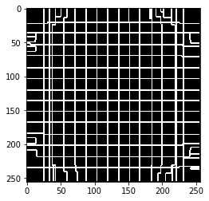
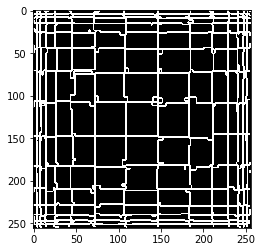
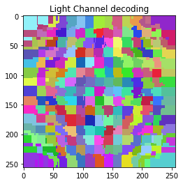
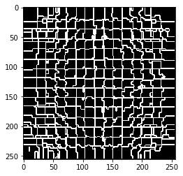
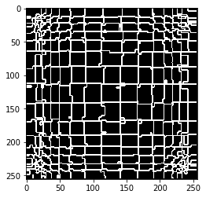
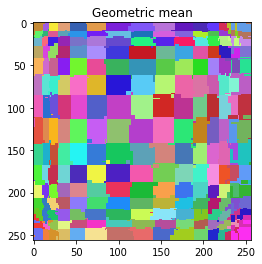
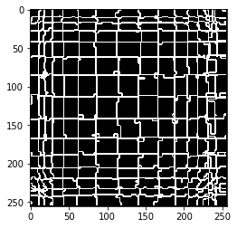
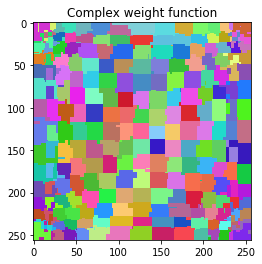
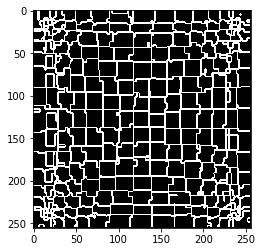

# Machine Learning technique on PET block detector development - Part 2-2

## Crystal/Pixel discrimination for DQS PET block detector using Machine Learning techniques (v1.0, 2019-09)   
## (Continued from Part 2-1)
---


###  
### 6. Scintillator/Pixel discrimination using ML algorithms - Part II, classification algorithms


```python
# load libraries

import uproot
import numpy as np
import pandas as pd
import matplotlib.pyplot as plt
import matplotlib as mpl
# %matplotlib qt
%matplotlib inline
# %matplotlib notebook

import pickle
from sklearn.externals import joblib
import time

plt.rcParams['figure.dpi'] = 120 # default is 72
```


```python
# re-load data

file = "D:\\ML on PET block\\new_concept_block_lso\\new_concept_block_15x15\\results\\ML_data\\new_concept_block_15x15_sorted_events1.csv"
df0 = pd.read_csv (file, comment='#')

X = df0.iloc[:,4:].values
decoding = df0.iloc[:,0:4].values

E_top = X[:,0:18]
E_bottom = X[:,18:36]

E_x1 = E_top[:, 0:18:2]
E_x2 = E_top[:, 18:0:-2]

E_y1 = E_bottom[:, 0:18:2]
E_y2 = E_bottom[:, 18:0:-2]

E_left = np.sum(E_x1, axis = 1)
E_right = np.sum(E_x2, axis = 1)

E_front = np.sum(E_y1, axis = 1)
E_back = np.sum(E_y2, axis = 1)

```


```python
infile = open('./pickle/temp_data1','rb')
X_t, X_b, X_a, X_g, X_c, index_train, index_test = pickle.load(infile)
infile.close()

```


```python
# pixel_xy = np.array(df0['index_y'] * 15 + df0['index_x'])
pixel_x = np.array(df0['index_x'])
pixel_y = np.array(df0['index_y'])
pixel_xy = pixel_y * 15 + pixel_x

pixel_x_train = pixel_x[index_train]
pixel_y_train = pixel_y[index_train]
pixel_xy_train = pixel_xy[index_train]

pixel_x_test = pixel_x[index_test]
pixel_y_test = pixel_y[index_test]
pixel_xy_test = pixel_xy[index_test]

```


```python
from sklearn.utils import check_random_state

def random_cmap(ncolors=256, random_state=None):
    """
    Generate a matplotlib colormap consisting of random (muted) colors.

    A random colormap is very useful for plotting segmentation images.

    Parameters
    ----------
    ncolors : int, optional
        The number of colors in the colormap.  The default is 256.

    random_state : int or `~numpy.random.RandomState`, optional
        The pseudo-random number generator state used for random
        sampling.  Separate function calls with the same
        ``random_state`` will generate the same colormap.

    Returns
    -------
    cmap : `matplotlib.colors.Colormap`
        The matplotlib colormap with random colors.
    """

    from matplotlib import colors

    prng = check_random_state(random_state)
    h = prng.uniform(low=0.0, high=1.0, size=ncolors)
    s = prng.uniform(low=0.4, high=0.9, size=ncolors)
    v = prng.uniform(low=0.7, high=1.0, size=ncolors)
    hsv = np.dstack((h, s, v))
    rgb = np.squeeze(colors.hsv_to_rgb(hsv))

    return colors.ListedColormap(rgb)
```


```python

def generate_grid(lut):
    """
    generate the grid of the lookup table from the lookup table data
    
    input: lookup table, numpy array
    output: grid as numpy array, the same size as the input 
    """
    
    lut_grid = np.zeros(lut.shape)
    pix_x, pix_y = lut_grid.shape

    for i in range(pix_x-1):
        for j in range(pix_y-1):
            if lut[i,j] != lut[i+1,j]:
                lut_grid[i,j] = 1
                lut_grid[i+1,j] = 1
            if lut[i,j] != lut[i,j+1]:
                lut_grid[i,j] = 1
                lut_grid[i,j+1] = 1
    
    return lut_grid
```

####  
#### 6.1 pixel discrimination using classification algorithms - using seperated x and y indices as the output


```python
from sklearn.tree import DecisionTreeClassifier
```


```python
def tree_fit(X, y, clf):
    clf.fit(X,y)
    return clf
```


```python
def plot_prediction_boundary2(reg_func1, reg_func2, cmap='hsv', alpha=1, axes=[0, 1.0, 0, 1.0], title=''):
    '''
    fitting the data with two functions, one for the x-axis and the other for the y-axis
    '''
    fig, ax = plt.subplots(figsize=(4,4))
    
    x1s = np.linspace(axes[0], axes[1], 256)
    x2s = np.linspace(axes[2], axes[3], 256)
    x1, x2 = np.meshgrid(x1s, x2s)
    X_new = np.c_[x1.ravel(), x2.ravel()]
    y1_pred = reg_func1.predict(X_new).reshape(x1.shape)
    y2_pred = reg_func2.predict(X_new).reshape(x1.shape)

    lut_pred = y1_pred+y2_pred*15
    plt.imshow(lut_pred, alpha=alpha, cmap=cmap)
    plt.title(title)
    
    return lut_pred

```


```python
def test_tree_classifier(X, y, index_train, index_test, depth):

    X_train = X[index_train]
    X_test = X[index_test]
    y1 = y[:,0]
    y2 = y[:,1]
    
    for tree_depth in depth:

        tree_clf1 = DecisionTreeClassifier(max_depth=tree_depth, random_state=0)
        tree_clf2 = DecisionTreeClassifier(max_depth=tree_depth, random_state=0)

        tree_fit(X_train, y1[index_train], tree_clf1)
        tree_fit(X_train, y2[index_train], tree_clf2)

        pixel_x_pred = tree_clf1.predict(X_test)
        pixel_y_pred = tree_clf2.predict(X_test)

        accuracy = sum(np.logical_and(y[index_test,0]==pixel_x_pred, y[index_test,1]==pixel_y_pred)) / index_test.size
        print('accuracy from tree classification (max_depth=%d): %f' % (tree_depth,accuracy))
        
    return tree_clf1, tree_clf2

```


```python

y = np.c_[df0['index_x'].ravel(), df0['index_y'].ravel()]

for X, notes in ((X_t,'Anger docoding'), ( X_b, 'Light Channel decoding'), \
                 (X_a,'Arithmatic mean'), (X_g,'Geometric mean'), \
                 (X_c,'Complex weight function')):
    print ('=== %s ==='%notes)
    clf1, clf2 = test_tree_classifier(X, y, index_train, index_test,depth=[2,3,4,5,6,7])
#    plot_prediction_boundary2(clf1, clf2, cmap=random_cmap())

```

    === Anger docoding ===
    accuracy from tree classification (max_depth=2): 0.069414
    accuracy from tree classification (max_depth=3): 0.208087
    accuracy from tree classification (max_depth=4): 0.495856
    accuracy from tree classification (max_depth=5): 0.497650
    accuracy from tree classification (max_depth=6): 0.497734
    accuracy from tree classification (max_depth=7): 0.497982
    === Light Channel decoding ===
    accuracy from tree classification (max_depth=2): 0.070344
    accuracy from tree classification (max_depth=3): 0.218346
    accuracy from tree classification (max_depth=4): 0.491528
    accuracy from tree classification (max_depth=5): 0.501557
    accuracy from tree classification (max_depth=6): 0.508955
    accuracy from tree classification (max_depth=7): 0.523365
    === Arithmatic mean ===
    accuracy from tree classification (max_depth=2): 0.071137
    accuracy from tree classification (max_depth=3): 0.224650
    accuracy from tree classification (max_depth=4): 0.521066
    accuracy from tree classification (max_depth=5): 0.558457
    accuracy from tree classification (max_depth=6): 0.563538
    accuracy from tree classification (max_depth=7): 0.566103
    === Geometric mean ===
    accuracy from tree classification (max_depth=2): 0.070982
    accuracy from tree classification (max_depth=3): 0.225265
    accuracy from tree classification (max_depth=4): 0.504764
    accuracy from tree classification (max_depth=5): 0.573199
    accuracy from tree classification (max_depth=6): 0.575184
    accuracy from tree classification (max_depth=7): 0.575582
    === Complex weight function ===
    accuracy from tree classification (max_depth=2): 0.070942
    accuracy from tree classification (max_depth=3): 0.210882
    accuracy from tree classification (max_depth=4): 0.473003
    accuracy from tree classification (max_depth=5): 0.503214
    accuracy from tree classification (max_depth=6): 0.512162
    accuracy from tree classification (max_depth=7): 0.528906
    

=== Anger docoding ===  
accuracy from tree classification (max_depth=2): 0.069414  
accuracy from tree classification (max_depth=3): 0.208087  
accuracy from tree classification (max_depth=4): 0.495856  
accuracy from tree classification (max_depth=5): 0.497650  
accuracy from tree classification (max_depth=6): 0.497734  
accuracy from tree classification (max_depth=7): 0.497982  
=== Light Channel decoding ===  
accuracy from tree classification (max_depth=2): 0.070344  
accuracy from tree classification (max_depth=3): 0.218346  
accuracy from tree classification (max_depth=4): 0.491528  
accuracy from tree classification (max_depth=5): 0.501557  
accuracy from tree classification (max_depth=6): 0.508955  
accuracy from tree classification (max_depth=7): 0.523365  
=== Arithmatic mean ===  
accuracy from tree classification (max_depth=2): 0.071137  
accuracy from tree classification (max_depth=3): 0.224650  
accuracy from tree classification (max_depth=4): 0.521066  
accuracy from tree classification (max_depth=5): 0.558457  
accuracy from tree classification (max_depth=6): 0.563538  
accuracy from tree classification (max_depth=7): 0.566103  
=== Geometric mean ===  
accuracy from tree classification (max_depth=2): 0.070982  
accuracy from tree classification (max_depth=3): 0.225265  
accuracy from tree classification (max_depth=4): 0.504764  
accuracy from tree classification (max_depth=5): 0.573199  
accuracy from tree classification (max_depth=6): 0.575184  
accuracy from tree classification (max_depth=7): 0.575582  
=== Complex weight function ===  
accuracy from tree classification (max_depth=2): 0.070942  
accuracy from tree classification (max_depth=3): 0.210882  
accuracy from tree classification (max_depth=4): 0.473003  
accuracy from tree classification (max_depth=5): 0.503214  
accuracy from tree classification (max_depth=6): 0.512162  
accuracy from tree classification (max_depth=7): 0.528906  


```python
y = np.c_[df0['index_x'].ravel(), df0['index_y'].ravel()]

for X, notes in ((X_t,'Anger docoding'), ( X_b, 'Light Channel decoding'), \
                 (X_a,'Arithmatic mean'), (X_g,'Geometric mean'), \
                 (X_c,'Complex weight function')):
    print ('=== %s ==='%notes)
    clf1, clf2 = test_tree_classifier(X, y, index_train, index_test,depth=[7])
    lut_pred = plot_prediction_boundary2(clf1, clf2, cmap=random_cmap(), title=notes)
    plt.figure()
    plt.imshow(generate_grid(lut_pred), cmap='gray')
```

    === Anger docoding ===
    accuracy from tree classification (max_depth=7): 0.497982
    === Light Channel decoding ===
    accuracy from tree classification (max_depth=7): 0.523365
    === Arithmatic mean ===
    accuracy from tree classification (max_depth=7): 0.566103
    === Geometric mean ===
    accuracy from tree classification (max_depth=7): 0.575582
    === Complex weight function ===
    accuracy from tree classification (max_depth=7): 0.528906
    





```python
# interactive mode to check the prediction/decoding
%matplotlib qt

fig_i, ax = plt.subplots(figsize=(4,4))

x1s = np.linspace(0, 1, 256)
x2s = np.linspace(0, 1, 256)
x1, x2 = np.meshgrid(x1s, x2s)
X_new = np.c_[x1.ravel(), x2.ravel()]
y1_pred = clf1.predict(X_new).reshape(x1.shape)
y2_pred = clf2.predict(X_new).reshape(x1.shape)

lut_pred = y1_pred+y2_pred*15
ax.imshow(lut_pred, alpha=1.0, cmap='prism')

def onclick(event):
    X1 = [[event.xdata/255, event.ydata/255]]
    y1 = clf1.predict(X1)
    y2 = clf2.predict(X1)
    print(y1, y2, y1+y2*15)

cid_mouse_press = fig_i.canvas.mpl_connect('button_press_event', onclick)
        
fig_i.show()

```


```python
%matplotlib inline
# %matplotlib notebook

```

* <b>Using tree classification algorithm, the accuracy could reach 0.56 - 0.57 for the arithmatic mean and geometric mean decoding, which exceed the results from lookup table and polynomial regression.</b>

####  
#### 6.2 pixel discrimination using classification algorithms - using combined xy index as the output


```python
def plot_prediction_boundary3(reg_func, cmap='hsv', alpha=1, axes=[0, 1.0, 0, 1.0], title=''):
    '''
    fitting the data with one function, the prediction is the unique pixel index
    '''
    fig, ax = plt.subplots(figsize=(4,4))
    
    x1s = np.linspace(axes[0], axes[1], 256)
    x2s = np.linspace(axes[2], axes[3], 256)
    x1, x2 = np.meshgrid(x1s, x2s)
    X_new = np.c_[x1.ravel(), x2.ravel()]
    pixel_xy_pred = reg_func.predict(X_new).reshape(x1.shape)

    lut_pred = pixel_xy_pred
    plt.imshow(lut_pred, alpha=alpha, cmap=cmap)
    plt.title(title)
    
    return lut_pred
```


```python
def test_tree_classifier2(X, y, index_train, index_test, depth):
    '''
    output y is the unique pixel index pixel_xy
    '''

    X_train = X[index_train]
    X_test = X[index_test]
    
    for tree_depth in depth:

        tree_clf = DecisionTreeClassifier(max_depth=tree_depth, random_state=0)

        tree_fit(X_train, y[index_train], tree_clf)

        pixel_xy_pred = tree_clf.predict(X_test)

        accuracy = sum(y[index_test]==pixel_xy_pred) / index_test.size
        print('accuracy from tree classification (max_depth=%d): %f' % (tree_depth,accuracy))
        
    return tree_clf
```


```python
y = df0['index_x'].ravel() + df0['index_y'].ravel()*15
```


```python
for X, notes in ((X_t,'Anger docoding'), ( X_b, 'Light Channel decoding'), \
                 (X_a,'Arithmatic mean'), (X_g,'Geometric mean'), \
                 (X_c,'Complex weight function')):
    print ('=== %s ==='%notes)
    clf = test_tree_classifier2(X, y, index_train, index_test,depth=[3,5,7,9,11,13,15])

```

    === Anger docoding ===
    accuracy from tree classification (max_depth=3): 0.034884
    accuracy from tree classification (max_depth=5): 0.120963
    accuracy from tree classification (max_depth=7): 0.342024
    accuracy from tree classification (max_depth=9): 0.495984
    accuracy from tree classification (max_depth=11): 0.494771
    accuracy from tree classification (max_depth=13): 0.489220
    accuracy from tree classification (max_depth=15): 0.478017
    === Light Channel decoding ===
    accuracy from tree classification (max_depth=3): 0.035106
    accuracy from tree classification (max_depth=5): 0.127993
    accuracy from tree classification (max_depth=7): 0.370813
    accuracy from tree classification (max_depth=9): 0.522532
    accuracy from tree classification (max_depth=11): 0.550785
    accuracy from tree classification (max_depth=13): 0.553190
    accuracy from tree classification (max_depth=15): 0.543750
    === Arithmatic mean ===
    accuracy from tree classification (max_depth=3): 0.035894
    accuracy from tree classification (max_depth=5): 0.129021
    accuracy from tree classification (max_depth=7): 0.371535
    accuracy from tree classification (max_depth=9): 0.567011
    accuracy from tree classification (max_depth=11): 0.575658
    accuracy from tree classification (max_depth=13): 0.573797
    accuracy from tree classification (max_depth=15): 0.564211
    === Geometric mean ===
    accuracy from tree classification (max_depth=3): 0.035801
    accuracy from tree classification (max_depth=5): 0.127758
    accuracy from tree classification (max_depth=7): 0.374490
    accuracy from tree classification (max_depth=9): 0.572743
    accuracy from tree classification (max_depth=11): 0.579033
    accuracy from tree classification (max_depth=13): 0.575791
    accuracy from tree classification (max_depth=15): 0.565983
    === Complex weight function ===
    accuracy from tree classification (max_depth=3): 0.035682
    accuracy from tree classification (max_depth=5): 0.131426
    accuracy from tree classification (max_depth=7): 0.372240
    accuracy from tree classification (max_depth=9): 0.559724
    accuracy from tree classification (max_depth=11): 0.571219
    accuracy from tree classification (max_depth=13): 0.569655
    accuracy from tree classification (max_depth=15): 0.560229
    

=== Anger docoding ===  
accuracy from tree classification (max_depth=3): 0.034884  
accuracy from tree classification (max_depth=5): 0.120963  
accuracy from tree classification (max_depth=7): 0.342024  
accuracy from tree classification (max_depth=9): 0.495984  
accuracy from tree classification (max_depth=11): 0.494771  
accuracy from tree classification (max_depth=13): 0.489220  
accuracy from tree classification (max_depth=15): 0.478017  
=== Light Channel decoding ===  
accuracy from tree classification (max_depth=3): 0.035106  
accuracy from tree classification (max_depth=5): 0.127993  
accuracy from tree classification (max_depth=7): 0.370813  
accuracy from tree classification (max_depth=9): 0.522532  
accuracy from tree classification (max_depth=11): 0.550785  
accuracy from tree classification (max_depth=13): 0.553190  
accuracy from tree classification (max_depth=15): 0.543750  
=== Arithmatic mean ===  
accuracy from tree classification (max_depth=3): 0.035894  
accuracy from tree classification (max_depth=5): 0.129021  
accuracy from tree classification (max_depth=7): 0.371535  
accuracy from tree classification (max_depth=9): 0.567011  
accuracy from tree classification (max_depth=11): 0.575658  
accuracy from tree classification (max_depth=13): 0.573797  
accuracy from tree classification (max_depth=15): 0.564211  
=== Geometric mean ===  
accuracy from tree classification (max_depth=3): 0.035801  
accuracy from tree classification (max_depth=5): 0.127758  
accuracy from tree classification (max_depth=7): 0.374490  
accuracy from tree classification (max_depth=9): 0.572743  
accuracy from tree classification (max_depth=11): 0.579033  
accuracy from tree classification (max_depth=13): 0.575791  
accuracy from tree classification (max_depth=15): 0.565983  
=== Complex weight function ===  
accuracy from tree classification (max_depth=3): 0.035682  
accuracy from tree classification (max_depth=5): 0.131426  
accuracy from tree classification (max_depth=7): 0.372240  
accuracy from tree classification (max_depth=9): 0.559724  
accuracy from tree classification (max_depth=11): 0.571219  
accuracy from tree classification (max_depth=13): 0.569655  
accuracy from tree classification (max_depth=15): 0.560229  


```python
for X, notes in ((X_t,'Anger docoding'), ( X_b, 'Light Channel decoding'), \
                 (X_a,'Arithmatic mean'), (X_g,'Geometric mean'), \
                 (X_c,'Complex weight function')):
    print ('=== %s ==='%notes)
    clf1 = test_tree_classifier2(X, y, index_train, index_test, depth=[11])
    lut_pred = plot_prediction_boundary3(clf1, cmap=random_cmap(), title=notes)
    plt.figure()
    plt.imshow(generate_grid(lut_pred), cmap='gray')
```

    === Anger docoding ===
    accuracy from tree classification (max_depth=11): 0.494771
    === Light Channel decoding ===
    accuracy from tree classification (max_depth=11): 0.550785
    === Arithmatic mean ===
    accuracy from tree classification (max_depth=11): 0.575658
    === Geometric mean ===
    accuracy from tree classification (max_depth=11): 0.579033
    === Complex weight function ===
    accuracy from tree classification (max_depth=11): 0.571219
    


























* <b>Using tree classification algorithm with one output variable, the unique pixel/scintillator index, the accuracy could reach 0.57 for all three decoding techniques that combine the Anger and Light Channel results. The results are slightly improved from the tree classification with two output variables in x and y directions respectively.</b>

####  
#### 6.3 pixel discrimination using SVM
***

The previous studies are using the Anger docoding or Light Channel decoding techniques, in which the input variables are the combinations of original input variables (photosensor counts). Here we will use the SVM algorithm along with the original input variables to see whether good prediction could be made.


```python
X_new
```


    array([[0.        , 0.        ],
           [0.00392157, 0.        ],
           [0.00784314, 0.        ],
           ...,
           [0.99215686, 1.        ],
           [0.99607843, 1.        ],
           [1.        , 1.        ]])


```python

```
