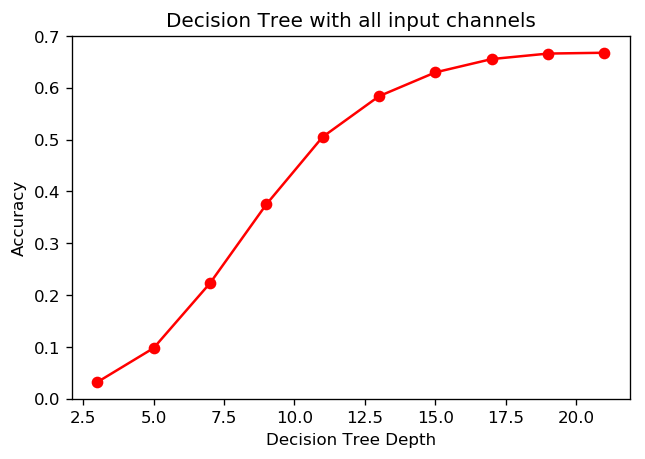
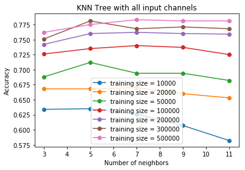
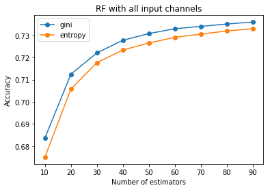
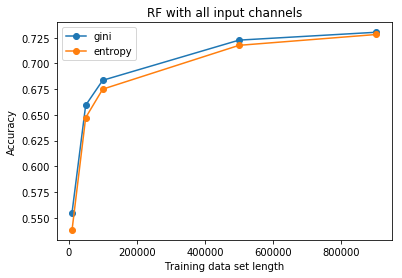
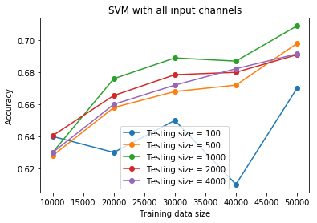

# Machine Learning technique on PET block detector development - Part 2-3

## Crystal/Pixel discrimination for DQS PET block detector using Machine Learning techniques (v1.0, 2019-09)   
## (Continued from Part 2-2)
---


###  
### 7. Scintillator/Pixel discrimination using ML algorithms - Part III, using original multi-channel inputs
    Previous studies are focused on the comparison using ML algorithms similar ot the conventional decoding algorithms, which are using the pre-processed input as the ML algorithms' input variable. Such input variables usually had only two inputs, which is much smaller than the original input channels (36 input in the raw data).  
    In this section, we are repeat some of the algorithms been used in the previous sections with new input variables, the orginal inputs. Moreover, we will also try other algorithms with such inputs as well.


```python
# load libraries

import uproot
import numpy as np
import pandas as pd
import matplotlib.pyplot as plt
import matplotlib as mpl
# %matplotlib qt
%matplotlib inline
# %matplotlib notebook

import pickle
from sklearn.externals import joblib
from sklearn import metrics
import time

plt.rcParams['figure.dpi'] = 120 # default is 72
```


```python
# re-load data

file = "D:\\ML on PET block\\new_concept_block_lso\\new_concept_block_15x15\\results\\ML_data\\new_concept_block_15x15_sorted_events1.csv"
df0 = pd.read_csv (file, comment='#')

X = df0.iloc[:,4:].values
decoding = df0.iloc[:,0:4].values

E_top = X[:,0:18]
E_bottom = X[:,18:36]

E_x1 = E_top[:, 0:18:2]
E_x2 = E_top[:, 18:0:-2]

E_y1 = E_bottom[:, 0:18:2]
E_y2 = E_bottom[:, 18:0:-2]

E_left = np.sum(E_x1, axis = 1)
E_right = np.sum(E_x2, axis = 1)

E_front = np.sum(E_y1, axis = 1)
E_back = np.sum(E_y2, axis = 1)

```


```python
infile = open('./pickle/temp_data1','rb')
X_t, X_b, X_a, X_g, X_c, index_train, index_test = pickle.load(infile)
infile.close()

```


```python
# pixel_xy = np.array(df0['index_y'] * 15 + df0['index_x'])
pixel_x = np.array(df0['index_x'])
pixel_y = np.array(df0['index_y'])
pixel_xy = pixel_y * 15 + pixel_x

pixel_x_train = pixel_x[index_train]
pixel_y_train = pixel_y[index_train]
pixel_xy_train = pixel_xy[index_train]

pixel_x_test = pixel_x[index_test]
pixel_y_test = pixel_y[index_test]
pixel_xy_test = pixel_xy[index_test]

```


```python
from sklearn.utils import check_random_state

def random_cmap(ncolors=256, random_state=None):
    """
    Generate a matplotlib colormap consisting of random (muted) colors.

    A random colormap is very useful for plotting segmentation images.

    Parameters
    ----------
    ncolors : int, optional
        The number of colors in the colormap.  The default is 256.

    random_state : int or `~numpy.random.RandomState`, optional
        The pseudo-random number generator state used for random
        sampling.  Separate function calls with the same
        ``random_state`` will generate the same colormap.

    Returns
    -------
    cmap : `matplotlib.colors.Colormap`
        The matplotlib colormap with random colors.
    """

    from matplotlib import colors

    prng = check_random_state(random_state)
    h = prng.uniform(low=0.0, high=1.0, size=ncolors)
    s = prng.uniform(low=0.4, high=0.9, size=ncolors)
    v = prng.uniform(low=0.7, high=1.0, size=ncolors)
    hsv = np.dstack((h, s, v))
    rgb = np.squeeze(colors.hsv_to_rgb(hsv))

    return colors.ListedColormap(rgb)
```


```python

def generate_grid(lut):
    """
    generate the grid of the lookup table from the lookup table data
    
    input: lookup table, numpy array
    output: grid as numpy array, the same size as the input 
    """
    
    lut_grid = np.zeros(lut.shape)
    pix_x, pix_y = lut_grid.shape

    for i in range(pix_x-1):
        for j in range(pix_y-1):
            if lut[i,j] != lut[i+1,j]:
                lut_grid[i,j] = 1
                lut_grid[i+1,j] = 1
            if lut[i,j] != lut[i,j+1]:
                lut_grid[i,j] = 1
                lut_grid[i,j+1] = 1
    
    return lut_grid
```

####  
#### 7.1 pixel discrimination using decision tree classification algorithms


```python
from sklearn.tree import DecisionTreeClassifier
```


```python
def plot_prediction_boundary3(reg_func, cmap='hsv', alpha=1, axes=[0, 1.0, 0, 1.0], title='', ax=None):
    '''
    fitting the data with one function, the prediction is the unique pixel index
    '''
    if ax == None:
        fig, ax = plt.subplots(figsize=(4,4))
    
    x1s = np.linspace(axes[0], axes[1], 256)
    x2s = np.linspace(axes[2], axes[3], 256)
    x1, x2 = np.meshgrid(x1s, x2s)
    X_new = np.c_[x1.ravel(), x2.ravel()]
    pixel_xy_pred = reg_func.predict(X_new).reshape(x1.shape)

    lut_pred = pixel_xy_pred
    ax.imshow(lut_pred, alpha=alpha, cmap=cmap)
    ax.set_title(title)
        
        
    return lut_pred
```


```python
def test_tree_classifier4(X, y, index_train, index_test, depth):
    '''
    output y is the unique pixel index pixel_xy
    '''

    X_train = X[index_train]
    X_test = X[index_test]
    y_train = y[index_train]
    y_test = y[index_test]
    

    tree_clf = DecisionTreeClassifier(max_depth=depth, random_state=0)
    tree_clf.fit(X_train, y_train)
    y_pred = tree_clf.predict(X_test)

    accuracy = sum(y_test==y_pred) / y_pred.size
    print('accuracy from tree classification (max_depth=%d): %f' % (depth,accuracy))

    return tree_clf, accuracy
```


```python
depth=[3,5,7,9,11,13,15,17,19,21]
#depth = [3,5]
accuracy = []

for index, n in enumerate(depth):
    clf, accu = test_tree_classifier4(X, pixel_xy, index_train, index_test, depth = n)
    accuracy.append(accu)
#    lut_pred = plot_prediction_boundary3(clf, cmap=random_cmap(), title='depth='+str(n), ax=ax[0,index])
#    ax[1,index].imshow(generate_grid(lut_pred), cmap='gray')

#scale = 3
plt.plot(depth, accuracy,'ro-')
plt.title("Decision Tree with all input channels")
plt.xlabel("Decision Tree Depth")
plt.ylabel("Accuracy")
plt.savefig(".\\figs2\\decisiontree_accu_with_all_channels.png", dpi=300)
```

    accuracy from tree classification (max_depth=3): 0.031930
    accuracy from tree classification (max_depth=5): 0.097685
    accuracy from tree classification (max_depth=7): 0.222758
    accuracy from tree classification (max_depth=9): 0.374902
    accuracy from tree classification (max_depth=11): 0.505185
    accuracy from tree classification (max_depth=13): 0.583720
    accuracy from tree classification (max_depth=15): 0.629709
    accuracy from tree classification (max_depth=17): 0.655389
    accuracy from tree classification (max_depth=19): 0.665976
    accuracy from tree classification (max_depth=21): 0.667570
    





<b> saved output <b>
***
accuracy from tree classification (max_depth=3): 0.031930  
accuracy from tree classification (max_depth=5): 0.097685  
accuracy from tree classification (max_depth=7): 0.222758  
accuracy from tree classification (max_depth=9): 0.374902  
accuracy from tree classification (max_depth=11): 0.505185  
accuracy from tree classification (max_depth=13): 0.583720  
accuracy from tree classification (max_depth=15): 0.629709  
accuracy from tree classification (max_depth=17): 0.655389  
accuracy from tree classification (max_depth=19): 0.665976  
accuracy from tree classification (max_depth=21): 0.667570  

* <b>Decision Tree with all channel inputs achieved better result of 0.667 than that with pre-processed inputs (0.57).

####  
#### 7.2 pixel discrimination using Naive Bayes method
***


```python
# Fitting Naive Bayes
from sklearn.naive_bayes import GaussianNB, BernoulliNB, MultinomialNB, ComplementNB

def NB(X, y, index_train, index_test):
    '''
    output y is the unique pixel index pixel_xy
    '''

    X_train = X[index_train]
    X_test = X[index_test]
    y_train = y[index_train]
    y_test = y[index_test]
    
    accuracy = []
    clfs = []
    
    for nb in ['GaussianNB', 'BernoulliNB', 'MultinomialNB', 'ComplementNB']:
        clf = globals()[nb]()
        clf.fit(X_train, y_train)
        clfs.append(clf)
        
        y_pred = clf.predict(X_test)
        accu = sum(y_test==y_pred) / y_test.size
        accuracy.append(accu)
        print('Accuracy from %s: %f' % (nb,accu))
        
    return clfs, accu
```


```python
clfs, accu = NB(X, pixel_xy, index_train, index_test)   
 
```

    Accuracy from GaussianNB: 0.445725
    Accuracy from BernoulliNB: 0.124037
    Accuracy from MultinomialNB: 0.649577
    Accuracy from ComplementNB: 0.146607
    

* <b>The Naive Bayes (Gassian) with all channel inputs result of 0.445 is not as good as that with preprocessed inputs of 0.507.</b>  
* <b>The Naive Bayes for multivariate Bernoulli models produces poor result.</b>
* <b>The Naive Bayes for multinomial models produces better result of 0.6496.</b>
* <b>The Naive Bayes (complement) produces poor result of 0.1466.</b>


####  
#### 7.3 pixel discrimination using KNN method
***


```python
from sklearn.neighbors import KNeighborsClassifier

```


```python
def KNN(X, y, index_train, index_test, neighbors=3):
    '''
    output y is the unique pixel index pixel_xy
    '''

    X_train = X[index_train]
    X_test = X[index_test]
    y_train = y[index_train]
    y_test = y[index_test]
    
    knn = KNeighborsClassifier(n_neighbors=neighbors, metric='minkowski', p=2, n_jobs=4)
    knn.fit(X_train, y_train)
    y_pred = knn.predict(X_test)

    accuracy = sum(y_test==y_pred) / y_test.size
    print("accuracy from KNN (neighbors=%d): %f" % (neighbors, accuracy))
        
    return knn, accuracy
```


```python
# since KNN store all data set and need to calculate everything in predicting process, so it's slow for large data set with multiple variables
# therefore we limit the number of data set for training and testing
train_len = 500000
test_len = 1000

#neighbor_range  = [3,5,7,9,11]
neighbor_range  = [3]

for index, n in enumerate(neighbor_range):
    clf, accu = KNN(X, pixel_xy, index_train[:train_len], index_test[:test_len], neighbors = n)
#    lut_pred = plot_prediction_boundary3(clf, cmap=random_cmap(), title='neighbors='+str(n), ax=ax[0,index])
#    ax[1,index].imshow(generate_grid(lut_pred), cmap='gray')

```

    accuracy from KNN (neighbors=3): 0.763000
    

<b> saved output <b>
***
train_len = 100000, test_len = 10000  
>>
accuracy from KNN (neighbors=3): 0.699300  
accuracy from KNN (neighbors=5): 0.707300  
accuracy from KNN (neighbors=7): 0.703700  
accuracy from KNN (neighbors=8): 0.704600  
accuracy from KNN (neighbors=11): 0.702800  
  
train_len = 200000, test_len = 1000
>>
accuracy from KNN (neighbors=3): 0.742000  
accuracy from KNN (neighbors=5): 0.760000  
accuracy from KNN (neighbors=7): 0.762000  
accuracy from KNN (neighbors=8): 0.763000  
accuracy from KNN (neighbors=11): 0.759000  
    
train_len = 400000, test_len = 1000
>>
accuracy from KNN (neighbors=3): 0.767000  
accuracy from KNN (neighbors=5): 0.781000  
accuracy from KNN (neighbors=7): 0.783000  
accuracy from KNN (neighbors=8): 0.781000  
accuracy from KNN (neighbors=11): 0.781000   

train_len = 800000, test_len = 1000
>>
accuracy from KNN (neighbors=3): 0.769000  
accuracy from KNN (neighbors=5): 0.767000  
accuracy from KNN (neighbors=7): 0.782000  
accuracy from KNN (neighbors=9): 0.784000  
accuracy from KNN (neighbors=11): 0.782000      


```python
import numpy as np

def KNN2(X, y, index_train, index_test, neighbors=3):
    '''
    output y is the unique pixel index pixel_xy
    '''

    X_train = X[index_train]
    X_test = X[index_test]
    y_train = y[index_train]
    y_test = y[index_test]
    
    accu = []
    
    if type(neighbors) == int:
        knn = KNeighborsClassifier(n_neighbors=n, metric='minkowski', p=2, n_jobs=4)
        knn.fit(X_train, y_train)
        y_pred = knn.predict(X_test)

        accuracy = sum(y_test==y_pred) / y_test.size
        print("accuracy from KNN (neighbors=%d): %f" % (neighbors, accuracy))
        
        return knn, accuracy
        
    elif type(neighbors)==list or type(neighbors)==np.ndarray:

        for n in neighbors:
            knn = KNeighborsClassifier(n_neighbors=n, metric='minkowski', p=2, n_jobs=4)
            knn.fit(X_train, y_train)
            y_pred = knn.predict(X_test)

            accuracy = sum(y_test==y_pred) / y_test.size
            print("accuracy from KNN (neighbors=%d): %f" % (n, accuracy))
            
            accu.append(accuracy)
        
        return knn, accu
    
    else:
        pass
    
    return 
```


```python
train_len = [10000, 20000, 50000, 100000, 200000, 300000, 500000]
test_len = 1000
accuracy = []
neighbors = [x for x in range(3,13,2)]

for L in train_len:
    clf, accu = KNN2(X, pixel_xy, index_train[:L], index_test[:test_len], neighbors = neighbors)
    accuracy.append(accu)
#    lut_pred = plot_prediction_boundary3(clf, cmap=random_cmap(), title='depth='+str(n), ax=ax[0,index])
#    ax[1,index].imshow(generate_grid(lut_pred), cmap='gray')

lines = []
for j in range(len(accuracy)):
    line, = plt.plot(neighbors, accuracy[j],'o-', label='training size = '+ str(train_len[j]))
    lines.append(line)
    
plt.title("KNN Tree with all input channels")
plt.xlabel("Number of neighbors")
plt.ylabel("Accuracy")
plt.legend()

plt.savefig(".\\figs2\\KNN_accu_with_all_channels.png", dpi=300)
```

    accuracy from KNN (neighbors=3): 0.634000
    accuracy from KNN (neighbors=5): 0.635000
    accuracy from KNN (neighbors=7): 0.626000
    accuracy from KNN (neighbors=9): 0.607000
    accuracy from KNN (neighbors=11): 0.582000
    accuracy from KNN (neighbors=3): 0.668000
    accuracy from KNN (neighbors=5): 0.668000
    accuracy from KNN (neighbors=7): 0.670000
    accuracy from KNN (neighbors=9): 0.660000
    accuracy from KNN (neighbors=11): 0.653000
    accuracy from KNN (neighbors=3): 0.688000
    accuracy from KNN (neighbors=5): 0.712000
    accuracy from KNN (neighbors=7): 0.694000
    accuracy from KNN (neighbors=9): 0.694000
    accuracy from KNN (neighbors=11): 0.682000
    accuracy from KNN (neighbors=3): 0.726000
    accuracy from KNN (neighbors=5): 0.735000
    accuracy from KNN (neighbors=7): 0.740000
    accuracy from KNN (neighbors=9): 0.737000
    accuracy from KNN (neighbors=11): 0.725000
    accuracy from KNN (neighbors=3): 0.742000
    accuracy from KNN (neighbors=5): 0.760000
    accuracy from KNN (neighbors=7): 0.762000
    accuracy from KNN (neighbors=9): 0.760000
    accuracy from KNN (neighbors=11): 0.759000
    accuracy from KNN (neighbors=3): 0.751000
    accuracy from KNN (neighbors=5): 0.781000
    accuracy from KNN (neighbors=7): 0.768000
    accuracy from KNN (neighbors=9): 0.771000
    accuracy from KNN (neighbors=11): 0.768000
    accuracy from KNN (neighbors=3): 0.762000
    accuracy from KNN (neighbors=5): 0.775000
    accuracy from KNN (neighbors=7): 0.783000
    accuracy from KNN (neighbors=9): 0.781000
    accuracy from KNN (neighbors=11): 0.781000
    





* <b>The KNN with all channel inputs could achieve over 0.70 with 100k events or 0.78 with 500k events which is much better than that with preprocessed inputs which is around 0.56.</b>  


####  
#### 7.4 pixel discrimination using Random Forest method
***


```python
from sklearn.ensemble import RandomForestClassifier

```


```python
X_train = X[index_train]
X_test = X[index_test]
y_train = pixel_xy[index_train]
y_test = pixel_xy[index_test]
```

#####  
##### 7.4.1 effect from number of estimator and criterion


```python
accuracy = []
n_est = [x for x in range(10,100,10)]
crits = ['gini','entropy']
train_length = 100000

for crit in crits:
    print("RF(crit=%s)" % (crit))
    accu = []
    
    for n in n_est:
        NF = RandomForestClassifier(n_estimators=n, criterion=crit, random_state=1, n_jobs=8, verbose=0)
        
        NF.fit(X_train[:train_length], y_train[:train_length])
        
        y_pred = NF.predict(X_test)
        a = sum(y_test==y_pred) / y_test.size
        print("--- accuracy from RF(n_est=%d, crit=%s): %f" % (n, crit, a))
        accu.append(a)
    
    accuracy.append(accu)

lines = []
for j in range(len(accuracy)):
    line, = plt.plot(n_est, accuracy[j], 'o-', label=crits[j])
    lines.append(line)
    
plt.title("RF with all input channels")
plt.xlabel("Number of estimators")
plt.ylabel("Accuracy")
plt.legend()

plt.savefig(".\\figs2\\RandomForest_accu_vs_estimators.png", dpi=300)

```

    RF(crit=gini)
    --- accuracy from RF(n_est=10, crit=gini): 0.683641
    --- accuracy from RF(n_est=20, crit=gini): 0.712479
    --- accuracy from RF(n_est=30, crit=gini): 0.722087
    --- accuracy from RF(n_est=40, crit=gini): 0.727788
    --- accuracy from RF(n_est=50, crit=gini): 0.730814
    --- accuracy from RF(n_est=60, crit=gini): 0.733006
    --- accuracy from RF(n_est=70, crit=gini): 0.734056
    --- accuracy from RF(n_est=80, crit=gini): 0.735124
    --- accuracy from RF(n_est=90, crit=gini): 0.736014
    RF(crit=entropy)
    --- accuracy from RF(n_est=10, crit=entropy): 0.675026
    --- accuracy from RF(n_est=20, crit=entropy): 0.705755
    --- accuracy from RF(n_est=30, crit=entropy): 0.717706
    --- accuracy from RF(n_est=40, crit=entropy): 0.723372
    --- accuracy from RF(n_est=50, crit=entropy): 0.726579
    --- accuracy from RF(n_est=60, crit=entropy): 0.729117
    --- accuracy from RF(n_est=70, crit=entropy): 0.730579
    --- accuracy from RF(n_est=80, crit=entropy): 0.731988
    --- accuracy from RF(n_est=90, crit=entropy): 0.733002
    





```python
train_length
```


    902988


#####  
##### 7.4.2 effect from data set length


```python
# compare data set length
train_lengths = [10000, 50000, 100000, 500000, index_train.size]

accuracy = []
n_est = [x for x in range(10,20,20)]
crits = ['gini','entropy']

for crit in crits:
    print("RF(crit=%s)" % (crit))
    accu = []
    
    for train_length in train_lengths:
        NF = RandomForestClassifier(n_estimators=10, criterion=crit, random_state=1, n_jobs=6, verbose=0)
        
        NF.fit(X_train[:train_length], y_train[:train_length])
        
        y_pred = NF.predict(X_test)
        a = sum(y_test==y_pred) / y_test.size
        print("--- accuracy from RF(n_est=%d, crit=%s): %f" % (n, crit, a))
        accu.append(a)
    
    accuracy.append(accu)

lines = []
for j in range(len(accuracy)):
    line, = plt.plot(train_lengths, accuracy[j], 'o-', label=crits[j])
    lines.append(line)
    
plt.title("RF with all input channels")
plt.xlabel("Training data set length")
plt.ylabel("Accuracy")
plt.legend()

plt.savefig(".\\figs2\\RandomForest_accu_vs_dataset_length.png", dpi=300)

```

    RF(crit=gini)
    --- accuracy from RF(n_est=90, crit=gini): 0.555179
    --- accuracy from RF(n_est=90, crit=gini): 0.659406
    --- accuracy from RF(n_est=90, crit=gini): 0.683641
    --- accuracy from RF(n_est=90, crit=gini): 0.722659
    --- accuracy from RF(n_est=90, crit=gini): 0.730313
    RF(crit=entropy)
    --- accuracy from RF(n_est=90, crit=entropy): 0.538275
    --- accuracy from RF(n_est=90, crit=entropy): 0.647380
    --- accuracy from RF(n_est=90, crit=entropy): 0.675026
    --- accuracy from RF(n_est=90, crit=entropy): 0.717600
    --- accuracy from RF(n_est=90, crit=entropy): 0.728138
    





```python
NF = RandomForestClassifier(n_estimators=10, criterion='gini', random_state=1, n_jobs=6, verbose=0)

for train_length in [100000, 200000]:
    t0 = time.time()
    NF.fit(X_train[:train_length], y_train[:train_length])
    t1 = time.time()
    print(t1-t0)
```

    25.071857929229736
    54.104488372802734
    


```python
train_length = 100000
for est in [10, 40, 100]:
    NF = RandomForestClassifier(n_estimators=est, criterion='gini', random_state=1, n_jobs=4, verbose=0)
    t0 = time.time()
    NF.fit(X_train[:train_length], y_train[:train_length])
    t1 = time.time()
    print(t1-t0)
```

    2.3440160751342773
    8.031768321990967
    19.548283100128174
    


```python
for test_length in [10000, 20000, 30000]:
    t0 = time.time()
    y_pred = NF.predict(X_test[:test_length])
    accu= sum(y_test[:test_length]==y_pred) / test_length
    t1 = time.time()
    print(accu, t1-t0)
```

    0.7364 1.3861305713653564
    0.7374 2.656273603439331
    0.7362333333333333 3.9002692699432373
    


```python
train_length = 200000
test_length = 100000

for mss in [2, 4, 6, 8, 20, 50, 100]:
    NF = RandomForestClassifier(min_samples_split = mss, random_state=1, n_jobs=6, n_estimators=10)
    t0 = time.time()
    NF.fit(X_train[:train_length], y_train[:train_length])
    y_pred = NF.predict(X_test[:test_length])
    accu= sum(y_test[:test_length]==y_pred) / test_length
    t1 = time.time()
    print(accu, t1-t0)
```

    0.7041 5.95348048210144
    0.71246 6.110172271728516
    0.71408 5.422134160995483
    0.71391 5.37605357170105
    0.71592 4.796994924545288
    0.70593 4.329159498214722
    0.69304 4.015939235687256
    


```python
train_length = 200000
test_length = 100000

for mf in [2, 4, 6, 12, 24, 36, 'auto', None]:
#for mf in [6]:
    NF = RandomForestClassifier(max_features=mf, random_state=1, n_jobs=6, n_estimators=10)
    t0 = time.time()
    NF.fit(X_train[:train_length], y_train[:train_length])
    y_pred = NF.predict(X_test[:test_length])
    accu= sum(y_test[:test_length]==y_pred) / test_length
    t1 = time.time()
    print(accu, t1-t0)
```

    0.64035 5.207427740097046
    0.68983 4.969175338745117
    0.7041 5.859835147857666
    0.71816 8.422591924667358
    0.72248 14.105207204818726
    0.71992 19.244724988937378
    0.7041 6.003503084182739
    0.71992 19.110494136810303
    


```python
train_length = 200000
test_length = 100000

for mln in [10, 100, 1000, 10000, 100000]:
    NF = RandomForestClassifier(max_leaf_nodes=mln, random_state=1, n_jobs=6, n_estimators=10)
    t0 = time.time()
    NF.fit(X_train[:train_length], y_train[:train_length])
    y_pred = NF.predict(X_test[:test_length])
    accu= sum(y_test[:test_length]==y_pred) / test_length
    t1 = time.time()
    print(accu, t1-t0)
```

    0.21822 2.7969777584075928
    0.52804 3.2918455600738525
    0.66778 4.141111612319946
    0.71383 4.719067811965942
    0.70731 6.359941720962524
    

<b> Summary </b>  
* training size:      accuracy [+], time [+]
* testing size:       accuracy [n], time [+]
* estimator:          accuracy [+], time [+]
* min_samples_split:  accuracy [n], time [-]
* max_features:       accuracy [+], time [+]
* max_leaf_nodes:     accuracy [+], time [+]

#####  
##### 7.4.3 Using optimized parameters for best accuracy


```python
NF = RandomForestClassifier(n_estimators=120, criterion='gini', min_samples_split=20, random_state=1, n_jobs=8, verbose=2)
t0 = time.time()
NF.fit(X_train, y_train)
y_pred = NF.predict(X_test)
accu= sum(y_test==y_pred) / y_test.size
t1 = time.time()
print(accu, t1-t0)
```

    [Parallel(n_jobs=8)]: Using backend ThreadingBackend with 8 concurrent workers.
    

    building tree 1 of 120building tree 2 of 120
    building tree 3 of 120building tree 4 of 120
    
    building tree 5 of 120
    
    building tree 6 of 120
    building tree 7 of 120building tree 8 of 120
    
    building tree 9 of 120
    building tree 10 of 120
    building tree 11 of 120
    building tree 12 of 120
    building tree 13 of 120
    building tree 14 of 120
    building tree 15 of 120
    building tree 16 of 120
    building tree 17 of 120
    building tree 18 of 120
    building tree 19 of 120
    building tree 20 of 120
    building tree 21 of 120
    building tree 22 of 120
    building tree 23 of 120
    building tree 24 of 120
    building tree 25 of 120
    building tree 26 of 120
    building tree 27 of 120
    building tree 28 of 120
    building tree 29 of 120
    building tree 30 of 120
    building tree 31 of 120
    building tree 32 of 120
    building tree 33 of 120
    building tree 34 of 120
    

    [Parallel(n_jobs=8)]: Done  25 tasks      | elapsed:   51.7s
    

    building tree 35 of 120
    building tree 36 of 120
    building tree 37 of 120
    building tree 38 of 120
    building tree 39 of 120
    building tree 40 of 120
    building tree 41 of 120
    building tree 42 of 120
    building tree 43 of 120
    building tree 44 of 120
    building tree 45 of 120
    building tree 46 of 120
    building tree 47 of 120
    building tree 48 of 120
    building tree 49 of 120
    building tree 50 of 120
    building tree 51 of 120
    building tree 52 of 120
    building tree 53 of 120
    building tree 54 of 120
    building tree 55 of 120
    building tree 56 of 120
    building tree 57 of 120
    building tree 58 of 120
    building tree 59 of 120
    building tree 60 of 120
    building tree 61 of 120
    building tree 62 of 120
    building tree 63 of 120
    building tree 64 of 120
    building tree 65 of 120
    building tree 66 of 120
    building tree 67 of 120
    building tree 68 of 120
    building tree 69 of 120
    building tree 70 of 120
    building tree 71 of 120
    building tree 72 of 120
    building tree 73 of 120
    building tree 74 of 120
    building tree 75 of 120
    building tree 76 of 120
    building tree 77 of 120
    building tree 78 of 120
    building tree 79 of 120
    building tree 80 of 120
    building tree 81 of 120
    building tree 82 of 120
    building tree 83 of 120
    building tree 84 of 120
    building tree 85 of 120
    building tree 86 of 120
    building tree 87 of 120
    building tree 88 of 120
    building tree 89 of 120
    building tree 90 of 120
    building tree 91 of 120
    building tree 92 of 120
    building tree 93 of 120
    building tree 94 of 120
    building tree 95 of 120
    building tree 96 of 120
    building tree 97 of 120
    building tree 98 of 120
    building tree 99 of 120
    building tree 100 of 120
    building tree 101 of 120
    building tree 102 of 120
    building tree 103 of 120
    building tree 104 of 120
    building tree 105 of 120
    building tree 106 of 120
    building tree 107 of 120
    building tree 108 of 120
    building tree 109 of 120
    building tree 110 of 120
    building tree 111 of 120
    building tree 112 of 120
    building tree 113 of 120
    building tree 114 of 120
    building tree 115 of 120
    building tree 116 of 120
    building tree 117 of 120
    building tree 118 of 120
    building tree 119 of 120
    building tree 120 of 120
    

    [Parallel(n_jobs=8)]: Done 120 out of 120 | elapsed:  3.4min finished
    [Parallel(n_jobs=8)]: Using backend ThreadingBackend with 8 concurrent workers.
    [Parallel(n_jobs=8)]: Done  25 tasks      | elapsed:   22.8s
    [Parallel(n_jobs=8)]: Done 120 out of 120 | elapsed:  1.5min finished
    

    0.7634608654821547 295.84202098846436
    

* <b>with optimized parameters, the accuracy of 0.7634608654821547 is achieved with RandomForest classifier.</b>

####  
#### 7.5 pixel discrimination using SVM method
***
The previous studies are using the Anger decoding or Light Channel decoding techniques, in which the input variables are the combinations of original input variables (photosensor counts). Here we will use the SVM algorithm along with the original input variables to see whether better prediction could be made from the original variables.  
<b>Since one of the SVM's advantage is that it works more effectively on high dimensional spaces, which means more input variables, it works better. With the Anger decoding or Light Channel decoding techniques, the 36 input variables are reduced to only two variables. which might not be suitable for SVM algorithm. 


```python
from sklearn.svm import SVC
```

#####  
##### 7.5.1 SVM using original 36 sensors input variables
* Based on the study results from [svm_test2](https://github.com/yzhang3000/Machine-Learning-Techniques-on-PET-block-detector-development/blob/master/python/svm_test2.md) memtioned above, we are choosing 'poly' as the kernel and data set length is 10k to 50k.


```python
# load the model generated by svm_test2

import pickle

svm_model_file ='.//models//svm_poly_50k.pkl'
fp = open(svm_model_file,'rb')
data = pickle.load(fp)
fp.close()
```


```python
data
```


    [[10000, 20000, 30000, 40000, 50000],
     [SVC(C=1.0, cache_size=200, class_weight=None, coef0=0.0,
        decision_function_shape='ovr', degree=3, gamma='auto', kernel='poly',
        max_iter=-1, probability=False, random_state=1, shrinking=True,
        tol=0.001, verbose=False),
      SVC(C=1.0, cache_size=200, class_weight=None, coef0=0.0,
        decision_function_shape='ovr', degree=3, gamma='auto', kernel='poly',
        max_iter=-1, probability=False, random_state=1, shrinking=True,
        tol=0.001, verbose=False),
      SVC(C=1.0, cache_size=200, class_weight=None, coef0=0.0,
        decision_function_shape='ovr', degree=3, gamma='auto', kernel='poly',
        max_iter=-1, probability=False, random_state=1, shrinking=True,
        tol=0.001, verbose=False),
      SVC(C=1.0, cache_size=200, class_weight=None, coef0=0.0,
        decision_function_shape='ovr', degree=3, gamma='auto', kernel='poly',
        max_iter=-1, probability=False, random_state=1, shrinking=True,
        tol=0.001, verbose=False),
      SVC(C=1.0, cache_size=200, class_weight=None, coef0=0.0,
        decision_function_shape='ovr', degree=3, gamma='auto', kernel='poly',
        max_iter=-1, probability=False, random_state=1, shrinking=True,
        tol=0.001, verbose=False)]]


* The variable **data** contains a list of SVC classifiers which are trained with the data set of 10k, 20k, 30k, 40k, 50k events, respectively.


```python
model = data[1][4]
```


```python
# test accuracy

testing_data_length = 1000

X_test = X[index_test[:testing_data_length]]
pixel_xy_pred = model.predict(X_test)
accuracy = sum(pixel_xy_test[:testing_data_length]==pixel_xy_pred) / testing_data_length
print('accuracy score: %f' % (metrics.accuracy_score(pixel_xy_test[:testing_data_length], pixel_xy_pred)))
 
```

    accuracy score: 0.709000
    


```python
accuracy = []
test_lens= [100,500,1000,2000,4000]

for test_len in test_lens:
    accu = []
    for train_len, clf in zip(data[0], data[1]):
        y_pred = clf.predict(X[index_test[:test_len]])
        accu.append( sum(y_pred==pixel_xy_test[:test_len]) / test_len)
    accuracy.append(accu)
        
```


```python
accuracy
```


    [[0.64, 0.63, 0.65, 0.61, 0.67],
     [0.628, 0.658, 0.668, 0.672, 0.698],
     [0.63, 0.676, 0.689, 0.687, 0.709],
     [0.6405, 0.6655, 0.6785, 0.68, 0.691],
     [0.63, 0.66, 0.672, 0.68225, 0.6915]]


```python
lines = []
for j in range(len(accuracy)):
    line, = plt.plot(data[0], accuracy[j],'o-', label='Testing size = '+ str(test_lens[j]))
    lines.append(line)
    
plt.title("SVM with all input channels")
plt.xlabel("Training data size")
plt.ylabel("Accuracy")
plt.legend()

plt.savefig(".\\figs2\\SVM_accu_with_all_channels.png", dpi=300)
```





```python

```

###  
### Conclusion - accuracy using all channel data as input
***
* Decision Tree: 0.667570 (max_depth=21) 
* Naive Bayes (GaussianNB): 0.445725  
* Naive Bayes (BernoulliNB): 0.124037  
* Naive Bayes (MultinomialNB): 0.649577  
* Naive Bayes (ComplementNB): 0.146607  
* KNN: 0.783 (500k training, 7 neighbors)
* Random Forest: 0.763 (estimator=120, criterion='gini', min_samples_split=20, fall training and testing)
* SVM: 0.691 (50k training, 4000 testing)  
  
  <b>The KNN and Random Forest achieved best results, however, KNN is slow on prediction, and RF is slow on fitting and require large amount of memory. SVM is extream slow in fitting, however, with smaller amount of training data, it could achieve good result. Decision Tree yield resonable results with reasonable fitting time. Naive Bayes gives the worst results.</b>

##  
## Continued in [Part 2-4](https://github.com/yzhang3000/Machine-Learning-Techniques-on-PET-block-detector-development/blob/master/python/PET_detector_block_02-.md)


```python

```
