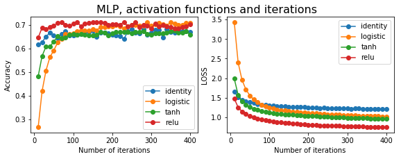

# Machine Learning technique on PET block detector development - Part 2-4

## Crystal/Pixel discrimination for DQS PET block detector using Machine Learning techniques (v1.0, 2019-09)   
## (Continued from Part 2-3)
---


###  
### 8. Scintillator/Pixel discrimination using ML algorithms - Part IV, using Neuro Network algorithm
***


```python
# load libraries

import uproot
import numpy as np
import pandas as pd
import matplotlib.pyplot as plt
import matplotlib as mpl
# %matplotlib qt
%matplotlib inline
# %matplotlib notebook

import pickle
from sklearn.externals import joblib
from sklearn import metrics
import time

plt.rcParams['figure.dpi'] = 120 # default is 72
```


```python
# re-load data

file = "D:\\ML on PET block\\new_concept_block_lso\\new_concept_block_15x15\\results\\ML_data\\new_concept_block_15x15_sorted_events1.csv"
df0 = pd.read_csv (file, comment='#')

X = df0.iloc[:,4:].values
decoding = df0.iloc[:,0:4].values

```


```python
infile = open('./pickle/temp_data1','rb')
X_t, X_b, X_a, X_g, X_c, index_train, index_test = pickle.load(infile)
infile.close()

```


```python
# pixel_xy = np.array(df0['index_y'] * 15 + df0['index_x'])
pixel_x = np.array(df0['index_x'])
pixel_y = np.array(df0['index_y'])
pixel_xy = pixel_y * 15 + pixel_x

pixel_x_train = pixel_x[index_train]
pixel_y_train = pixel_y[index_train]
pixel_xy_train = pixel_xy[index_train]

pixel_x_test = pixel_x[index_test]
pixel_y_test = pixel_y[index_test]
pixel_xy_test = pixel_xy[index_test]

```

####  
#### 8.1 pixel discrimination using ANN algorithm from sklearn MLP classifier


```python
from sklearn.neural_network import MLPClassifier

X_train = X[index_train]
X_test = X[index_test]
y_train = pixel_xy[index_train]
y_test = pixel_xy[index_test]
```


```python

train_length = 20000
test_length = 1000

t0 = time.time()
mlp = MLPClassifier(hidden_layer_sizes=(36,30), activation='logistic', max_iter=50, warm_start=True, verbose=True)
mlp.fit(X_train[:train_length],y_train[:train_length])
y_pred = mlp.predict(X_test[:test_length])
accu= sum(y_test[:test_length]==y_pred) / test_length
t1 = time.time()
print(accu, t1-t0)

```

    Iteration 1, loss = 5.39806428
    Iteration 2, loss = 5.27865488
    Iteration 3, loss = 4.97004941
    Iteration 4, loss = 4.60513156
    Iteration 5, loss = 4.28707826
    Iteration 6, loss = 4.02161169
    Iteration 7, loss = 3.79116923
    Iteration 8, loss = 3.58412266
    Iteration 9, loss = 3.40035428
    Iteration 10, loss = 3.23616909
    Iteration 11, loss = 3.09086623
    Iteration 12, loss = 2.96147892
    Iteration 13, loss = 2.84439253
    Iteration 14, loss = 2.73884575
    Iteration 15, loss = 2.64435978
    Iteration 16, loss = 2.55739088
    Iteration 17, loss = 2.47747422
    Iteration 18, loss = 2.40257637
    Iteration 19, loss = 2.33235250
    Iteration 20, loss = 2.26793813
    Iteration 21, loss = 2.20669978
    Iteration 22, loss = 2.15049892
    Iteration 23, loss = 2.09768510
    Iteration 24, loss = 2.04888761
    Iteration 25, loss = 2.00375291
    Iteration 26, loss = 1.96221178
    Iteration 27, loss = 1.92107573
    Iteration 28, loss = 1.88377336
    Iteration 29, loss = 1.84746939
    Iteration 30, loss = 1.81265184
    Iteration 31, loss = 1.78193344
    Iteration 32, loss = 1.75168466
    Iteration 33, loss = 1.72072500
    Iteration 34, loss = 1.69254317
    Iteration 35, loss = 1.66575966
    Iteration 36, loss = 1.63925357
    Iteration 37, loss = 1.61704226
    Iteration 38, loss = 1.59632726
    Iteration 39, loss = 1.57221413
    Iteration 40, loss = 1.55273630
    Iteration 41, loss = 1.53528501
    Iteration 42, loss = 1.51878124
    Iteration 43, loss = 1.50348027
    Iteration 44, loss = 1.48681373
    Iteration 45, loss = 1.47056462
    Iteration 46, loss = 1.45640938
    Iteration 47, loss = 1.44430286
    Iteration 48, loss = 1.43059976
    Iteration 49, loss = 1.41740491
    Iteration 50, loss = 1.40741860
    0.634 11.235021591186523
    

    C:\ProgramData\Anaconda3\lib\site-packages\sklearn\neural_network\multilayer_perceptron.py:562: ConvergenceWarning: Stochastic Optimizer: Maximum iterations (50) reached and the optimization hasn't converged yet.
      % self.max_iter, ConvergenceWarning)
    

##### 8.1.1 compare the activation functions and iterations


```python
accuracy = []
activation = ['identity', 'logistic', 'tanh', 'relu']

train_length = 20000
test_length = 1000

mlps = []
for act in activation:
    mlp = MLPClassifier(hidden_layer_sizes=(24,30), activation=act, max_iter=1, warm_start=True)
    mlps.append(mlp)
```


```python
loss = [[],[],[],[]]
accuracy = [[],[],[],[]]
iteration = [[],[],[],[]]

for index, act in enumerate(activation): 
    for iter in range(40):
        for i in range(10):
            mlps[index].fit(X_train[:train_length], y_train[:train_length])
        loss[index].append(mlps[index].loss_)
        iteration[index].append(mlps[index].n_iter_)
        
        y_pred = mlps[index].predict(X_test[:test_length])
        a = sum(y_test[:test_length]==y_pred) / test_length
        accuracy[index].append(a)
```


```python
fig, ax = plt.subplots(1,2, figsize=(8,3))
fig.suptitle('MLP, activation functions and iterations', fontsize=16)
fig.tight_layout()
fig.subplots_adjust(top=0.9)

lines = []
for j in range(len(accuracy)):
    line, = ax[0].plot(iteration[j], accuracy[j], 'o-', label=activation[j])
    lines.append(line)
    
#ax[0].set_title("")
ax[0].set_xlabel("Number of iterations")
ax[0].set_ylabel("Accuracy")
ax[0].legend()


lines = []
for j in range(len(loss)):
    line, = ax[1].plot(iteration[j], loss[j], 'o-', label=activation[j])
    lines.append(line)
    
#ax[1].set_title("")
ax[1].set_xlabel("Number of iterations")
ax[1].set_ylabel("LOSS")
ax[1].legend()

plt.savefig(".\\figs2\\MLP_accu_vs_iteration1.png", dpi=300)

```





##### 8.1.2 compare the hidden layer node number ('relu' and 'logistic' only) using grid search


```python
from sklearn.model_selection import GridSearchCV

train_length = 20000
test_length = 1000

parameters = {'activation':('logistic', 'relu'), 'hidden_layer_sizes':((18,30),(24,30),(30,30), (18,28),(24,28),(30,28))}
mlp = MLPClassifier(max_iter=200)
clf = GridSearchCV(mlp, parameters, n_jobs=-1, cv=5)

clf.fit(X_train[:train_length], y_train[:train_length])

```


    GridSearchCV(cv=5, error_score='raise-deprecating',
           estimator=MLPClassifier(activation='relu', alpha=0.0001, batch_size='auto', beta_1=0.9,
           beta_2=0.999, early_stopping=False, epsilon=1e-08,
           hidden_layer_sizes=(100,), learning_rate='constant',
           learning_rate_init=0.001, max_iter=200, momentum=0.9,
           n_iter_no_change=10, nesterovs_momentum=True, power_t=0.5,
           random_state=None, shuffle=True, solver='adam', tol=0.0001,
           validation_fraction=0.1, verbose=False, warm_start=False),
           fit_params=None, iid='warn', n_jobs=-1,
           param_grid={'activation': ('logistic', 'relu'), 'hidden_layer_sizes': ((18, 30), (24, 30), (30, 30), (18, 28), (24, 28), (30, 28))},
           pre_dispatch='2*n_jobs', refit=True, return_train_score='warn',
           scoring=None, verbose=0)


```python
clf.cv_results_
```

    C:\ProgramData\Anaconda3\lib\site-packages\sklearn\utils\deprecation.py:125: FutureWarning: You are accessing a training score ('split0_train_score'), which will not be available by default any more in 0.21. If you need training scores, please set return_train_score=True
      warnings.warn(*warn_args, **warn_kwargs)
    C:\ProgramData\Anaconda3\lib\site-packages\sklearn\utils\deprecation.py:125: FutureWarning: You are accessing a training score ('split1_train_score'), which will not be available by default any more in 0.21. If you need training scores, please set return_train_score=True
      warnings.warn(*warn_args, **warn_kwargs)
    C:\ProgramData\Anaconda3\lib\site-packages\sklearn\utils\deprecation.py:125: FutureWarning: You are accessing a training score ('split2_train_score'), which will not be available by default any more in 0.21. If you need training scores, please set return_train_score=True
      warnings.warn(*warn_args, **warn_kwargs)
    C:\ProgramData\Anaconda3\lib\site-packages\sklearn\utils\deprecation.py:125: FutureWarning: You are accessing a training score ('split3_train_score'), which will not be available by default any more in 0.21. If you need training scores, please set return_train_score=True
      warnings.warn(*warn_args, **warn_kwargs)
    C:\ProgramData\Anaconda3\lib\site-packages\sklearn\utils\deprecation.py:125: FutureWarning: You are accessing a training score ('split4_train_score'), which will not be available by default any more in 0.21. If you need training scores, please set return_train_score=True
      warnings.warn(*warn_args, **warn_kwargs)
    C:\ProgramData\Anaconda3\lib\site-packages\sklearn\utils\deprecation.py:125: FutureWarning: You are accessing a training score ('mean_train_score'), which will not be available by default any more in 0.21. If you need training scores, please set return_train_score=True
      warnings.warn(*warn_args, **warn_kwargs)
    C:\ProgramData\Anaconda3\lib\site-packages\sklearn\utils\deprecation.py:125: FutureWarning: You are accessing a training score ('std_train_score'), which will not be available by default any more in 0.21. If you need training scores, please set return_train_score=True
      warnings.warn(*warn_args, **warn_kwargs)
    


    {'mean_fit_time': array([102.1584702 ,  98.36205587, 104.84083319,  99.6859231 ,
             97.76597848,  99.37345157,  87.00778489,  81.87143407,
             86.03088822,  88.99717097,  94.59618611,  69.13071861]),
     'std_fit_time': array([ 0.6538248 ,  7.6650371 ,  0.5287279 ,  0.44717807,  7.2603844 ,
             7.30707587, 12.54637155, 19.65955311, 10.08080667, 10.70765811,
            10.23645759, 15.11921269]),
     'mean_score_time': array([0.05225348, 0.054741  , 0.05333114, 0.0503273 , 0.05511847,
            0.05596828, 0.04907022, 0.0487072 , 0.04950075, 0.04900808,
            0.04874964, 0.03437581]),
     'std_score_time': array([0.00321432, 0.00430929, 0.0038725 , 0.00088073, 0.00484105,
            0.00436606, 0.00327775, 0.00313215, 0.00342524, 0.00347262,
            0.00170821, 0.00624757]),
     'param_activation': masked_array(data=['logistic', 'logistic', 'logistic', 'logistic',
                        'logistic', 'logistic', 'relu', 'relu', 'relu', 'relu',
                        'relu', 'relu'],
                  mask=[False, False, False, False, False, False, False, False,
                        False, False, False, False],
            fill_value='?',
                 dtype=object),
     'param_hidden_layer_sizes': masked_array(data=[(18, 30), (24, 30), (30, 30), (18, 28), (24, 28),
                        (30, 28), (18, 30), (24, 30), (30, 30), (18, 28),
                        (24, 28), (30, 28)],
                  mask=[False, False, False, False, False, False, False, False,
                        False, False, False, False],
            fill_value='?',
                 dtype=object),
     'params': [{'activation': 'logistic', 'hidden_layer_sizes': (18, 30)},
      {'activation': 'logistic', 'hidden_layer_sizes': (24, 30)},
      {'activation': 'logistic', 'hidden_layer_sizes': (30, 30)},
      {'activation': 'logistic', 'hidden_layer_sizes': (18, 28)},
      {'activation': 'logistic', 'hidden_layer_sizes': (24, 28)},
      {'activation': 'logistic', 'hidden_layer_sizes': (30, 28)},
      {'activation': 'relu', 'hidden_layer_sizes': (18, 30)},
      {'activation': 'relu', 'hidden_layer_sizes': (24, 30)},
      {'activation': 'relu', 'hidden_layer_sizes': (30, 30)},
      {'activation': 'relu', 'hidden_layer_sizes': (18, 28)},
      {'activation': 'relu', 'hidden_layer_sizes': (24, 28)},
      {'activation': 'relu', 'hidden_layer_sizes': (30, 28)}],
     'split0_test_score': array([0.62466357, 0.62931245, 0.66405677, 0.60435527, 0.64741864,
            0.67335454, 0.68020553, 0.66650355, 0.67555664, 0.66723758,
            0.67457793, 0.66625887]),
     'split1_test_score': array([0.66888889, 0.65185185, 0.67876543, 0.60320988, 0.63432099,
            0.65753086, 0.67703704, 0.68074074, 0.68814815, 0.67802469,
            0.68765432, 0.69432099]),
     'split2_test_score': array([0.58364591, 0.63865966, 0.66266567, 0.58464616, 0.64291073,
            0.6744186 , 0.66791698, 0.67591898, 0.68767192, 0.66466617,
            0.6724181 , 0.68217054]),
     'split3_test_score': array([0.6289181 , 0.63068756, 0.67669363, 0.63447927, 0.6627907 ,
            0.66506572, 0.690091  , 0.70273003, 0.69615774, 0.67846309,
            0.69034378, 0.690091  ]),
     'split4_test_score': array([0.63050154, 0.64227226, 0.67093142, 0.61617195, 0.6486694 ,
            0.67221085, 0.66171955, 0.67502559, 0.67374616, 0.66299898,
            0.67425793, 0.67630502]),
     'mean_test_score': array([0.6274 , 0.63855, 0.6706 , 0.60845, 0.64715, 0.6685 , 0.67545,
            0.6801 , 0.68425, 0.6703 , 0.67985, 0.6818 ]),
     'std_test_score': array([0.02711499, 0.00825864, 0.00649649, 0.01636913, 0.00926151,
            0.00641941, 0.00978345, 0.01215252, 0.0083945 , 0.00662893,
            0.00754649, 0.01003132]),
     'rank_test_score': array([11, 10,  6, 12,  9,  8,  5,  3,  1,  7,  4,  2]),
     'split0_train_score': array([0.66819581, 0.69345818, 0.72695281, 0.65575316, 0.69886257,
            0.72519324, 0.76817696, 0.78439012, 0.79739835, 0.75755671,
            0.77351851, 0.78841199]),
     'split1_train_score': array([0.69128527, 0.69661442, 0.72394984, 0.63398119, 0.68338558,
            0.70482759, 0.76407524, 0.77774295, 0.79184953, 0.76269592,
            0.77855799, 0.77937304]),
     'split2_train_score': array([0.62839823, 0.68601962, 0.71645522, 0.62321105, 0.6927692 ,
            0.72382976, 0.7503906 , 0.75064058, 0.78107618, 0.74639085,
            0.77413912, 0.76782701]),
     'split3_train_score': array([0.65713039, 0.66635502, 0.71684119, 0.65588382, 0.68667415,
            0.71254051, 0.76545749, 0.77250062, 0.78521566, 0.758726  ,
            0.76963351, 0.78153827]),
     'split4_train_score': array([0.68058663, 0.69879443, 0.73695004, 0.65088243, 0.70140442,
            0.72588864, 0.7686428 , 0.77895849, 0.80182699, 0.75988069,
            0.77976634, 0.79014417]),
     'mean_train_score': array([0.66511926, 0.68824834, 0.72422982, 0.64394233, 0.69261918,
            0.71845595, 0.76334862, 0.77284655, 0.79147334, 0.75705004,
            0.77512309, 0.7814589 ]),
     'std_train_score': array([0.02165927, 0.01176978, 0.007541  , 0.01310931, 0.00688165,
            0.00836945, 0.00669667, 0.01172867, 0.0076119 , 0.00559594,
            0.00366161, 0.0079242 ])}


```python
clf.best_params_
```


    {'activation': 'relu', 'hidden_layer_sizes': (30, 30)}


```python
y_pred = clf.best_estimator_.predict(X_test[:test_length])
print('accuracy = %f' % (sum(y_test[:test_length]==y_pred) / test_length))

```

    accuracy = 0.698000
    


```python
from sklearn.model_selection import GridSearchCV

train_length = 20000
test_length = 1000

parameters = {'hidden_layer_sizes':((30,30),(40,30),(60,30), (30,40),(40,40),(60,40))}
mlp = MLPClassifier(max_iter=200)
clf = GridSearchCV(mlp, parameters, n_jobs=-1, cv=5)

clf.fit(X_train[:train_length], y_train[:train_length])

```

    C:\ProgramData\Anaconda3\lib\site-packages\sklearn\neural_network\multilayer_perceptron.py:562: ConvergenceWarning: Stochastic Optimizer: Maximum iterations (200) reached and the optimization hasn't converged yet.
      % self.max_iter, ConvergenceWarning)
    


    GridSearchCV(cv=5, error_score='raise-deprecating',
           estimator=MLPClassifier(activation='relu', alpha=0.0001, batch_size='auto', beta_1=0.9,
           beta_2=0.999, early_stopping=False, epsilon=1e-08,
           hidden_layer_sizes=(100,), learning_rate='constant',
           learning_rate_init=0.001, max_iter=200, momentum=0.9,
           n_iter_no_change=10, nesterovs_momentum=True, power_t=0.5,
           random_state=None, shuffle=True, solver='adam', tol=0.0001,
           validation_fraction=0.1, verbose=False, warm_start=False),
           fit_params=None, iid='warn', n_jobs=-1,
           param_grid={'hidden_layer_sizes': ((30, 30), (40, 30), (60, 30), (30, 40), (40, 40), (60, 40))},
           pre_dispatch='2*n_jobs', refit=True, return_train_score='warn',
           scoring=None, verbose=0)


```python
clf.cv_results_
```

    C:\ProgramData\Anaconda3\lib\site-packages\sklearn\utils\deprecation.py:125: FutureWarning: You are accessing a training score ('split0_train_score'), which will not be available by default any more in 0.21. If you need training scores, please set return_train_score=True
      warnings.warn(*warn_args, **warn_kwargs)
    C:\ProgramData\Anaconda3\lib\site-packages\sklearn\utils\deprecation.py:125: FutureWarning: You are accessing a training score ('split1_train_score'), which will not be available by default any more in 0.21. If you need training scores, please set return_train_score=True
      warnings.warn(*warn_args, **warn_kwargs)
    C:\ProgramData\Anaconda3\lib\site-packages\sklearn\utils\deprecation.py:125: FutureWarning: You are accessing a training score ('split2_train_score'), which will not be available by default any more in 0.21. If you need training scores, please set return_train_score=True
      warnings.warn(*warn_args, **warn_kwargs)
    C:\ProgramData\Anaconda3\lib\site-packages\sklearn\utils\deprecation.py:125: FutureWarning: You are accessing a training score ('split3_train_score'), which will not be available by default any more in 0.21. If you need training scores, please set return_train_score=True
      warnings.warn(*warn_args, **warn_kwargs)
    C:\ProgramData\Anaconda3\lib\site-packages\sklearn\utils\deprecation.py:125: FutureWarning: You are accessing a training score ('split4_train_score'), which will not be available by default any more in 0.21. If you need training scores, please set return_train_score=True
      warnings.warn(*warn_args, **warn_kwargs)
    C:\ProgramData\Anaconda3\lib\site-packages\sklearn\utils\deprecation.py:125: FutureWarning: You are accessing a training score ('mean_train_score'), which will not be available by default any more in 0.21. If you need training scores, please set return_train_score=True
      warnings.warn(*warn_args, **warn_kwargs)
    C:\ProgramData\Anaconda3\lib\site-packages\sklearn\utils\deprecation.py:125: FutureWarning: You are accessing a training score ('std_train_score'), which will not be available by default any more in 0.21. If you need training scores, please set return_train_score=True
      warnings.warn(*warn_args, **warn_kwargs)
    


    {'mean_fit_time': array([ 95.26415172,  97.93745456, 104.18100877, 103.33856502,
            108.00257888,  89.10769224]),
     'std_fit_time': array([14.78132282, 13.96621989, 12.33600644,  5.97208427, 10.87426813,
             8.01892185]),
     'mean_score_time': array([0.05353107, 0.05233755, 0.05595126, 0.05436096, 0.05793548,
            0.03125482]),
     'std_score_time': array([7.26742435e-03, 3.22613714e-03, 4.34008301e-03, 4.41341115e-03,
            7.66894591e-03, 1.19113884e-06]),
     'param_hidden_layer_sizes': masked_array(data=[(30, 30), (40, 30), (60, 30), (30, 40), (40, 40),
                        (60, 40)],
                  mask=[False, False, False, False, False, False],
            fill_value='?',
                 dtype=object),
     'params': [{'hidden_layer_sizes': (30, 30)},
      {'hidden_layer_sizes': (40, 30)},
      {'hidden_layer_sizes': (60, 30)},
      {'hidden_layer_sizes': (30, 40)},
      {'hidden_layer_sizes': (40, 40)},
      {'hidden_layer_sizes': (60, 40)}],
     'split0_test_score': array([0.6682163 , 0.66307805, 0.67237583, 0.66846097, 0.67237583,
            0.67653536]),
     'split1_test_score': array([0.68493827, 0.6817284 , 0.68790123, 0.6854321 , 0.68197531,
            0.68296296]),
     'split2_test_score': array([0.67791948, 0.67516879, 0.68317079, 0.67866967, 0.66766692,
            0.67466867]),
     'split3_test_score': array([0.68806876, 0.69160768, 0.68604651, 0.67947422, 0.68731041,
            0.69287159]),
     'split4_test_score': array([0.67016377, 0.67528147, 0.67630502, 0.65788127, 0.67246673,
            0.67784033]),
     'mean_test_score': array([0.67785, 0.6773 , 0.68115, 0.67405, 0.67635, 0.68095]),
     'std_test_score': array([0.00783195, 0.00935413, 0.00592517, 0.0096844 , 0.00717072,
            0.00653406]),
     'rank_test_score': array([3, 4, 1, 6, 5, 2]),
     'split0_train_score': array([0.79463332, 0.81461698, 0.82768805, 0.82423176, 0.84383837,
            0.86281657]),
     'split1_train_score': array([0.79322884, 0.80288401, 0.82714734, 0.82438871, 0.83893417,
            0.85981191]),
     'split2_train_score': array([0.77145178, 0.79657521, 0.81513655, 0.81332417, 0.81307418,
            0.85907131]),
     'split3_train_score': array([0.77586637, 0.80709299, 0.82460733, 0.81201695, 0.83308402,
            0.85845176]),
     'split4_train_score': array([0.78666418, 0.81487696, 0.82885906, 0.81295053, 0.82910763,
            0.86104897]),
     'mean_train_score': array([0.7843689 , 0.80720923, 0.82468767, 0.81738243, 0.83160767,
            0.8602401 ]),
     'std_train_score': array([0.00925495, 0.00700674, 0.00497359, 0.00567276, 0.01053743,
            0.00155177])}


```python
print(clf.best_params_)
```

    {'mean_fit_time': array([ 95.26415172,  97.93745456, 104.18100877, 103.33856502,
           108.00257888,  89.10769224]), 'std_fit_time': array([14.78132282, 13.96621989, 12.33600644,  5.97208427, 10.87426813,
            8.01892185]), 'mean_score_time': array([0.05353107, 0.05233755, 0.05595126, 0.05436096, 0.05793548,
           0.03125482]), 'std_score_time': array([7.26742435e-03, 3.22613714e-03, 4.34008301e-03, 4.41341115e-03,
           7.66894591e-03, 1.19113884e-06]), 'param_hidden_layer_sizes': masked_array(data=[(30, 30), (40, 30), (60, 30), (30, 40), (40, 40),
                       (60, 40)],
                 mask=[False, False, False, False, False, False],
           fill_value='?',
                dtype=object), 'params': [{'hidden_layer_sizes': (30, 30)}, {'hidden_layer_sizes': (40, 30)}, {'hidden_layer_sizes': (60, 30)}, {'hidden_layer_sizes': (30, 40)}, {'hidden_layer_sizes': (40, 40)}, {'hidden_layer_sizes': (60, 40)}], 'split0_test_score': array([0.6682163 , 0.66307805, 0.67237583, 0.66846097, 0.67237583,
           0.67653536]), 'split1_test_score': array([0.68493827, 0.6817284 , 0.68790123, 0.6854321 , 0.68197531,
           0.68296296]), 'split2_test_score': array([0.67791948, 0.67516879, 0.68317079, 0.67866967, 0.66766692,
           0.67466867]), 'split3_test_score': array([0.68806876, 0.69160768, 0.68604651, 0.67947422, 0.68731041,
           0.69287159]), 'split4_test_score': array([0.67016377, 0.67528147, 0.67630502, 0.65788127, 0.67246673,
           0.67784033]), 'mean_test_score': array([0.67785, 0.6773 , 0.68115, 0.67405, 0.67635, 0.68095]), 'std_test_score': array([0.00783195, 0.00935413, 0.00592517, 0.0096844 , 0.00717072,
           0.00653406]), 'rank_test_score': array([3, 4, 1, 6, 5, 2]), 'split0_train_score': array([0.79463332, 0.81461698, 0.82768805, 0.82423176, 0.84383837,
           0.86281657]), 'split1_train_score': array([0.79322884, 0.80288401, 0.82714734, 0.82438871, 0.83893417,
           0.85981191]), 'split2_train_score': array([0.77145178, 0.79657521, 0.81513655, 0.81332417, 0.81307418,
           0.85907131]), 'split3_train_score': array([0.77586637, 0.80709299, 0.82460733, 0.81201695, 0.83308402,
           0.85845176]), 'split4_train_score': array([0.78666418, 0.81487696, 0.82885906, 0.81295053, 0.82910763,
           0.86104897]), 'mean_train_score': array([0.7843689 , 0.80720923, 0.82468767, 0.81738243, 0.83160767,
           0.8602401 ]), 'std_train_score': array([0.00925495, 0.00700674, 0.00497359, 0.00567276, 0.01053743,
           0.00155177])}
    {'hidden_layer_sizes': (60, 30)}
    


```python
y_pred = clf.best_estimator_.predict(X_test[:test_length])
print('accuracy = %f' % (sum(y_test[:test_length]==y_pred) / test_length))

```

    accuracy = 0.708000
    


```python
from sklearn.model_selection import GridSearchCV

train_length = 20000
test_length = 1000

parameters = {'hidden_layer_sizes':((60,30),(90,30),(120,30),(150,30))}
mlp = MLPClassifier(max_iter=200)
clf = GridSearchCV(mlp, parameters, n_jobs=-1, cv=5)

clf.fit(X_train[:train_length], y_train[:train_length])
```

    C:\ProgramData\Anaconda3\lib\site-packages\sklearn\neural_network\multilayer_perceptron.py:562: ConvergenceWarning: Stochastic Optimizer: Maximum iterations (200) reached and the optimization hasn't converged yet.
      % self.max_iter, ConvergenceWarning)
    


    GridSearchCV(cv=5, error_score='raise-deprecating',
           estimator=MLPClassifier(activation='relu', alpha=0.0001, batch_size='auto', beta_1=0.9,
           beta_2=0.999, early_stopping=False, epsilon=1e-08,
           hidden_layer_sizes=(100,), learning_rate='constant',
           learning_rate_init=0.001, max_iter=200, momentum=0.9,
           n_iter_no_change=10, nesterovs_momentum=True, power_t=0.5,
           random_state=None, shuffle=True, solver='adam', tol=0.0001,
           validation_fraction=0.1, verbose=False, warm_start=False),
           fit_params=None, iid='warn', n_jobs=-1,
           param_grid={'hidden_layer_sizes': ((60, 30), (90, 30), (120, 30), (150, 30))},
           pre_dispatch='2*n_jobs', refit=True, return_train_score='warn',
           scoring=None, verbose=0)


```python
print(clf.best_params_)
```

    {'hidden_layer_sizes': (120, 30)}
    


```python
y_pred = clf.best_estimator_.predict(X_test[:test_length])
print('accuracy = %f' % (sum(y_test[:test_length]==y_pred) / test_length))

```

    accuracy = 0.708000
    

* <b>Best params: 'relu', hidden layers (120,30)</b>

##### 8.1.3 compare the training data set length


```python

train_length = [10000, 20000, 50000, 100000, 200000]
test_length = 10000

mlp = MLPClassifier(hidden_layer_sizes=(120,30), activation='relu', max_iter=1000, warm_start=False)
accuracy = []
proc_time = []

for train_len in train_length:
    t0 = time.time()
    mlp.fit(X_train[:train_len],y_train[:train_len])
    y_pred = mlp.predict(X_test[:test_length])
    accu= sum(y_test[:test_length]==y_pred) / test_length
    t1 = time.time()
    accuracy.append(accu)
    proc_time.append(t1-t0)
    print('accuracy = %f, proc_time = %f' % (accu, t1-t0))
        
```

    accuracy = 0.669600, proc_time = 28.483763
    accuracy = 0.681800, proc_time = 74.995822
    accuracy = 0.713200, proc_time = 115.991215
    accuracy = 0.733900, proc_time = 284.612884
    accuracy = 0.748100, proc_time = 478.281921
    


```python
fig, ax = plt.subplots(1,1, figsize=(6,4))
fig.suptitle('MLP')

color1 = 'tab:red'
l1 = ax.plot(train_length, accuracy, 'o-', color=color1)
ax.set_xlabel('Fitting data length')
ax.set_ylabel('Accuracy')
ax.tick_params(axis='y', labelcolor=color1)
ax.legend( l1, ['Accuracy'], loc='upper left', shadow=True)

color2 = 'tab:blue'
ax2 = ax.twinx()
l2 = ax2.plot(train_length, proc_time,'s-', color=color2)
ax2.legend( l2, ['Proc time'], loc='lower right', shadow=True)
ax2.tick_params(axis='y', labelcolor=color2)
ax2.set_ylabel('Proc time (s)')

plt.savefig(".\\figs2\\MLP_accu,time_vs_data_length2.png", dpi=300)

```


    Text(0, 0.5, 'Proc time (s)')


```python
# using full training set and testing set

t0 = time.time()
mlp.fit(X_train,y_train)
y_pred = mlp.predict(X_test)
accu= sum(y_test==y_pred) / y_test.shape
t1 = time.time()
print('accuracy = %f, proc_time = %f' % (accu, t1-t0))

```

    accuracy = 0.754761, proc_time = 2727.836644
    


```python
import pickle

filename = './models/MLP_relu_120,30_iter1000_fulltraining.pkl'
datafile = open(filename,'wb')
pickle.dump(mlp, datafile)
datafile.close()

```


```python
mlp.score(X_train,y_train)
```


    0.7588428639140277


```python
mlp.score(X_test,y_test)
```


    0.7547608606094434


```python

```

#####  
##### 8.1.4 What if using only one hidden layer?


```python

train_length = [10000, 20000, 50000, 100000, 200000]
test_length = 10000

mlp1 = MLPClassifier(hidden_layer_sizes=(120), activation='relu', max_iter=1000, warm_start=False)
accuracy = []
proc_time = []

for train_len in train_length:
    t0 = time.time()
    mlp1.fit(X_train[:train_len],y_train[:train_len])
    y_pred = mlp1.predict(X_test[:test_length])
    accu= sum(y_test[:test_length]==y_pred) / test_length
    t1 = time.time()
    accuracy.append(accu)
    proc_time.append(t1-t0)
    print('accuracy = %f, 
          proc_time = %f' % (accu, t1-t0))
        
```

    C:\ProgramData\Anaconda3\lib\site-packages\sklearn\neural_network\multilayer_perceptron.py:564: UserWarning: Training interrupted by user.
      warnings.warn("Training interrupted by user.")
    

    accuracy = 0.666600, proc_time = 25.986786
    

    C:\ProgramData\Anaconda3\lib\site-packages\sklearn\neural_network\multilayer_perceptron.py:564: UserWarning: Training interrupted by user.
      warnings.warn("Training interrupted by user.")
    

    accuracy = 0.680000, proc_time = 61.732107
    accuracy = 0.707900, proc_time = 119.200347
    

    C:\ProgramData\Anaconda3\lib\site-packages\sklearn\neural_network\multilayer_perceptron.py:564: UserWarning: Training interrupted by user.
      warnings.warn("Training interrupted by user.")
    

    accuracy = 0.717100, proc_time = 274.932041
    

* <b>Accuracy with one hidden layer is slightly worse than that with two hidden layers, and the processing time of one hidden layer is similar to that with two hidden layers.</b>

####  
#### 8.2 pixel discrimination using ANN algorithm from keras


```python
from keras.models import Sequential
from keras.layers import Dense, Activation
from keras.utils import np_utils
import keras
```

    Using TensorFlow backend.
    


```python
#del model

def relu1 (x): 
    return keras.activations.relu(x, max_value=10.)

model  = Sequential()

# input layer
model.add(Dense(36, activation=relu1, input_shape=(36,)))

# hidden layer
model.add(Dense(120, activation=relu1))

# hidden lyaer (output layer, 15 x and 15 y)
model.add(Dense(30, activation=relu1))

# output layer (pixel index 15 by 15 = 225)
model.add(Dense(225, activation='sigmoid'))

```


```python
model.compile(loss='categorical_crossentropy', optimizer='adam', metrics=['accuracy'])

#model.compile(loss='mean_absolute_error', optimizer='sgd', metrics=['accuracy'])
```


```python
y_train1 = np_utils.to_categorical(y_train, 225)
y_test1 = np_utils.to_categorical(y_test, 225)
```


```python
#train_length = [10000, 20000, 50000, 100000, 200000]
#train_length = [100000]
train_length = [X_train.size]
test_length = 1000

accuracy = []
proc_time = []

for train_len in train_length:
    t0 = time.time()
    model.fit(X_train[:train_len],y_train1[:train_len], batch_size=64,  epochs=1)
    score = model.evaluate(X_test[:test_length], y_test1[:test_length], batch_size=64)
    t1 = time.time()
    accuracy.append(score)
    proc_time.append(t1-t0)
    print('accuracy = %f, proc_time = %f' % (score[1], t1-t0))
    
```

    Epoch 1/1
    902988/902988 [==============================] - 33s 37us/step - loss: 1.0694 - acc: 0.7098
    1000/1000 [==============================] - 0s 20us/step
    accuracy = 0.739000, proc_time = 33.394866
    


```python
t0 = time.time()
score = model.evaluate(X_test, y_test1, batch_size=64)
t1 = time.time()
proc_time.append(t1-t0)
print('accuracy = %f, proc_time = %f' % (score[1], t1-t0))

```

    225747/225747 [==============================] - 3s 14us/step
    accuracy = 0.709312, proc_time = 3.234628
    

* <b>Using default setup of 'ReLU', the loss function could reach 'nan' after certain computations. Therefore, we need to modify the default ReLU function and limit the maxvalue of the ReLU function.</b>


###  
### Conclusion 
***

* <b>Using Sklearn MLP classifier with the optimized parameters obtained through grid search, the model is trained with all the training data set. The accuracy with the full testing data set is 0.754761 after 2727 secconds fo processing time.</b>  
  * Parameters of the MLP model: hidden_layer_sizes=(120,30), activation='relu', max_iter=1000
* <b>Using Keras ANN library, the accuracy is 0.7037 after one epoch.</b>


```python

```
